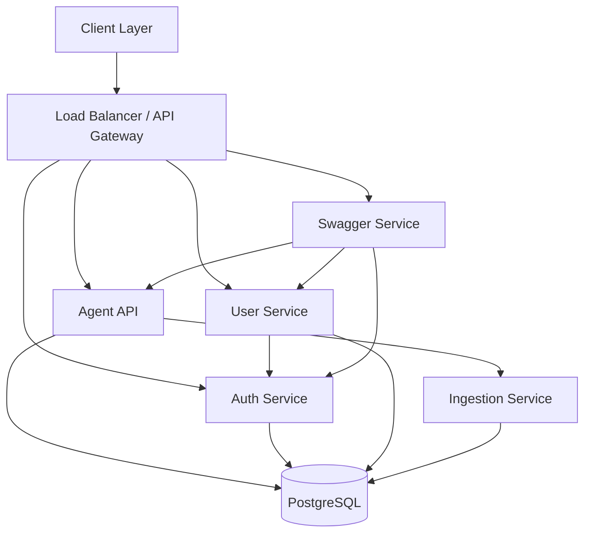

# Architecture

## System Overview

The Housing Microservices Platform implements a modern, scalable architecture with the following key components:

1.  **Agent API** (FastAPI/Python): Handles chat, SSE, documents, and attachments.
2.  **Ingestion Service** (FastAPI/Python): Processes documents (MarkItDown), chunks, embeds, and indexes data.
3.  **Auth Service** (Flask/Python): Authentication and user management.
4.  **User Service** (Flask/Python): User profile management.
5.  **Swagger Aggregator Service** (TypeScript/Node.js): Centralized API documentation (optional/not currently deployed).
6.  **PostgreSQL Database**: Shared data persistence with `pgvector` support.
7.  **Docker Environment**: Container orchestration for local, dev, and prod.

## Architecture Diagram

## Component Details

### 1. Agent API
-   **Tech**: FastAPI, LangGraph.
-   **Role**: Main entry point for chat and document interactions.
-   **Features**: SSE for streaming responses, document upload handling.

### 2. Ingestion Service
-   **Tech**: FastAPI.
-   **Role**: Document processing pipeline.
-   **Flow**: MarkItDown -> Chunking -> Embedding -> Indexing (pgvector).
-   **Deployment**: Runs on EC2, replaces previous Lambda-based architecture.

### 3. Auth Service
-   **Tech**: Flask, SQLAlchemy, Argon2, PyJWT.
-   **Role**: Issues and verifies JWTs.
-   **Security**: Rate limiting, input validation, secure headers.

### 4. User Service
-   **Tech**: Flask.
-   **Role**: Manages user profiles and data.
-   **Dependencies**: Relies on Auth Service for token verification.

### 5. Shared Data Layer
-   **Tech**: Python package (`packages/shared_data_layer`).
-   **Role**: Single source of truth for DB models, repositories, and schemas.
-   **Components**:
    -   `models/`: SQLAlchemy models (Users, Documents, Agents, etc.).
    -   `repositories/`: Async data access patterns.
    -   `schemas/`: Pydantic DTOs.

### 6. PostgreSQL Database
-   **Version**: 16.
-   **Extensions**: `pgvector` for semantic search.
-   **Databases**: `housing` (Agent/Shared), `auth_db` (Auth/User).

## Data Flow

### User Registration
1.  Client POSTs to `/auth/register`.
2.  Auth Service validates input and hashes password (Argon2).
3.  User record created in `users` table.

### Document Ingestion
1.  Client uploads document to Agent API.
2.  Agent API stores file and triggers Ingestion Service.
3.  Ingestion Service processes file (MarkItDown).
4.  Text is chunked and embedded.
5.  Chunks and embeddings stored in `chunks` table (pgvector).

## Deployment Architecture
-   **Local**: Docker Compose (with optional LocalStack).
-   **Dev Hybrid**: Local services connecting to cloud data plane.
-   **Production**: AWS EC2 with Docker Compose.
