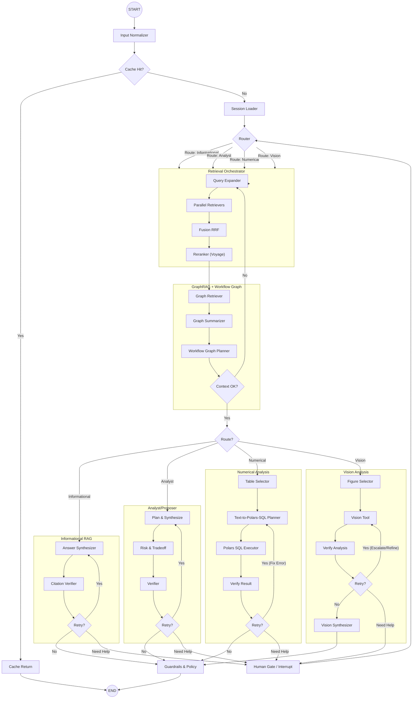

# Detailed Agent Design: LangGraph Router & Subgraphs

## 1. Architecture Overview

This design implements a **Graph-based Agent** using **LangGraph**, adhering to the "Router -> Subgraph" architecture. The system is designed for high determinism, explicit control flow, and robust state management.

### Core Principles
- **Explicit Control**: No "black box" agent loops. Every transition is defined by edges.
- **State Isolation**: Subgraphs have their own state schemas, inheriting from the parent state where necessary.
- **Persistence**: `MemorySaver` (or a persistent DB checkpointer) is used to save state at every super-step, enabling "time travel" and human-in-the-loop (HITL).
- **Parallelism**: Retrieval operations run in parallel using LangGraph's `Send` API or parallel branches.
- **Resilience & Self-Correction**: Every subgraph includes explicit **verification** and **retry** loops.
- **Smart Human-in-the-Loop (HITL)**: The agent can **dynamically interrupt** execution at any point (via a `HumanGate` node or `interrupt` function) when it detects ambiguity, low confidence, or missing information, resuming exactly where it left off after user input.
- **Graph Memory**: A GraphRAG layer maintains an entity/relationship graph plus workflow graphs so Analyst/Numerical routes can reason over patterns, dependencies, and proven troubleshooting sequences rather than only flat chunks.

## 2. Graph Diagram



## 3. Component Details

### 3.1. State Schema

We use `TypedDict` for strict typing.

```python
from typing import TypedDict, List, Optional, Any, Annotated
import operator
from langgraph.types import interrupt

class AgentState(TypedDict):
    # Conversation & Context
    messages: Annotated[List[Any], operator.add]
    conversation_id: str
    thread_id: str
    country_code: Optional[str]
    doc_version_ids: List[str]
    scope_hash: str
    
    # Routing & Control
    route: str # 'informational', 'analyst', 'numerical', 'vision'
    route_confidence: float
    loop_counter: int
    retry_counter: int # For self-correction loops
    error_log: List[str] # Track errors for reflection
    interrupts: List[Any]
    deadlines: dict # per-phase timeout metadata
    
    # Retrieval Artifacts
    raw_candidates: List[Any]
    fused_candidates: List[Any]
    reranked_candidates: List[Any]
    final_context: List[Any]
    retrieval_metrics: dict # latency, k, repairs, relaxations
    cache_key: str
    cache_hit: bool
    
    # Graph Reasoning
    graph_context: List[Any]
    workflow_plan: Optional[dict]
    workflow_plan_version: Optional[str]
    
    # Tool Results
    sql_query: Optional[str]
    sql_result: Optional[Any] # Polars DataFrame or list of dicts
    vision_analysis: Optional[str]
    
    # Final Output
    answer: str
    citations: List[dict]
    quality_score: float
    
    # Rate limiting & telemetry
    rate_limiter_permits: List[dict]
    token_usage: dict
```

`graph_context` caches entity/relationship clusters, graph summaries, and community-level metadata returned by the GraphRAG layer, while `workflow_plan` holds the synthesized workflow-graph steps (high/mid/low granularity) that downstream subgraphs replay or refine.

### 3.2. Nodes & Logic

#### **InputNormalizer**
- **Function**: `normalize_input(state: AgentState) -> AgentState`
- **Logic**: Cleans user input, extracts metadata (country code), and kicks off document-scope resolution:
    1. Query curated base documents for the detected `country_code`.
    2. Load `conversation_documents` (with `visibility_override`) for the `thread_id`.
    3. Merge explicit attachments from the request payload.
    4. Filter out `visibility="hidden"`, mark `read_only` docs for numerical guardrails, and persist new links / ref-count updates.
    5. Compute `scope_hash = hash(sorted(doc_version_ids + visibility states))` and stash it in state for cache and telemetry.
    6. Emit `normalized_input` payloads via `services/agent-api/src/nodes/retrieval/input_normalizer_node.py`, including detected language/intent tags, tenant scope metadata, attachment provenance flags, and guardrail warnings to short-circuit Router/HITL logic when users reference hidden assets.
- **Cache Key**: After normalization, compute `cache_key = hash(country_code, normalized_prompt, scope_hash, route_hint, tool_parameters, retrieval_parameters)` and set `state["cache_hit"]` if Valkey already stores a finalized answer matching that key.
- **Tools**: None (Pure logic).

**Example** (trimmed for brevity)

```jsonc
// gateway payload
{
  "thread_id": "thr_92aa2",
  "message": {
    "content": "  Compare Liberia base docs   ",
    "attachments": [
      {"type": "document_reference", "document_id": "doc_user_budget", "visibility": "visible"}
    ]
  },
  "constraints": {"country_code": "LBR", "auto_attach_base_docs": true},
  "hints": {"route": "analyst"}
}

// normalized_input stored in AgentState
{
  "normalized_prompt": "Compare Liberia base docs",
  "language_code": "en",
  "intent_tags": ["route:analyst"],
  "tenant_scope": {
    "conversation_id": "thr_92aa2",
    "thread_id": "thr_92aa2",
    "country_code": "LBR"
  },
  "attachment_refs": [
    {"asset_type": "document", "document_id": "doc_user_budget", "provided_in_request": true},
    {"asset_type": "document", "document_id": "doc_base_macro", "auto_attached": true}
  ],
  "scope_hash": "37e8…",
  "warnings": ["Auto-attached 1 base document(s) for LBR"]
}
```

**TODOs for follow-up tasks**: plug Valkey cache lookups into the same node (currently only the scope hash is produced) and extend the detector to choose country defaults when conversations omit `constraints.country_code`.

#### **AttachmentScopeLoader**
- **Function**: `load_attachment_scope(state: AgentState) -> AgentState`
- **Logic**: Fetch hydrated documents + workflow graphs referenced by `normalized_input.attachment_refs` using shared data layer repositories (`ConversationScopeRepository` + `WorkflowGraphRepository`). Validates each reference is still visible, annotates read-only or missing assets with guardrail warnings, and emits a deterministic `attachment_scope` structure consumed by Retrieval/GraphRetriever nodes.
- **Implementation**: `services/agent-api/src/nodes/retrieval/attachment_scope_loader_node.py` + `tests/nodes/retrieval/test_attachment_scope_loader_node.py` cover happy-path + missing asset scenarios. Missing docs/workflows populate `attachment_scope.missing_assets` so Router/HITL can request clarification before continuing.
- **Data contract**: `attachment_scope.documents[]` carries canonical name, scope, language, visibility, and provenance flags (`auto_attached`, `read_only`). `attachment_scope.workflows[]` surfaces workflow domain/version/status metadata so WorkflowPlanner can diff against cached plans without another DB hit.

#### **Router**
- **Function**: `RouterNode(state: AgentState) -> dict`
- **Logic**:
    1. Run `GuardrailEngine` (`services/agent-api/src/guardrails/engine.py`) using the declarative policy in `src/guardrails/policy.py`. Violations populate `state.guardrail_findings`; blocking issues immediately set `route=escalate` and `next_subgraph=human_gate`.
    2. When guardrails pass, deterministically rank intents via:
        - `normalized_input.intent_tags` (`route:<hint>`) — yields 0.9 confidence and short-circuits classification.
        - Keyword heuristics (`calculate`, `plan`, `image`, etc.) plus digit density.
        - `workflow_plan.steps[].tool_hints` (e.g., `polars`, `vision`) to reinforce Numerical/Vision routes.
    3. Emit structured output with `route`, `route_confidence`, `router_reason`, and `next_subgraph` aligning to LangGraph node names (`informational_subgraph`, `analyst_subgraph`, `numerical_subgraph`, `vision_subgraph`, `human_gate`).
- **Implementation**: `services/agent-api/src/nodes/router/router_node.py` with tests in `tests/router/test_router_node.py`.
- **Sample output**:

```jsonc
{
  "route": "numerical",
  "route_confidence": 0.9,
  "router_reason": "hint",
  "next_subgraph": "numerical_subgraph",
  "guardrails_passed": true,
  "guardrail_findings": [],
  "cache_metadata": {"cache_key": "agent-api:retrieval:conv-7:route-numerical:..."}
}
```

- Task 07 (CacheWriter) inspects `cache_metadata` + `route`, while Task 08 (HumanGate) relies on `guardrails_passed` + `guardrail_findings` to determine whether to pause the graph.

- **Future hooks**: TODO Task 12 wires SSE telemetry (`router_decision` event) + Prometheus counters. Guardrail docs live in `docs/security/guardrails.md` / `docs/security/prompt_policy.md`.

- **Reduced scope guard**: When `settings.reduced_scope.enabled` is true (Epic 3.5), the Router automatically downgrades `numerical`/`vision` routes to `informational`, emits a `demo_mode_skipped` SSE frame, and annotates `state.reduced_scope_flags`. This keeps the orchestration graph deterministic while still preserving the downstream nodes for post-demo reactivation.

#### **Retrieval Orchestrator (Subgraph)**
This is a crucial component handling the "RAG" part.

1.  **ParallelRetrievers**:
    -   **Logic**: Fans out to 4 retrievers: Text (Vector), Table (Vector), Image (Vector), Keyword (BM25/TSQuery).
    -   **Implementation**: Use `langgraph.constants.Send` to trigger parallel nodes if they are separate, or a single node running `asyncio.gather`.
    -   **Voyage AI Integration**:
        ```python
        import voyageai
        vo = voyageai.Client()
        # Embed query
        query_emb = vo.embed([query], model="voyage-3.5-lite").embeddings[0]
        # Search pgvector with query_emb
        ```

2.  **Fusion (RRF)**:
    -   **Logic**: Combines results using Reciprocal Rank Fusion.
    -   **Formula**: `score = sum(1 / (k + rank_i))` where `k=60`.

3.  **Reranker**:
    -   **Logic**: Re-scores top N candidates using Voyage AI.
    -   **Voyage AI Integration**:
        ```python
        reranking = vo.rerank(
            query, 
            documents=[doc.text for doc in candidates], 
            model="rerank-2.5-lite", 
            top_k=10
        )
        # Update state with reranking.results
        ```

4.  **GraphRAG + Workflow Graph**:
    -   **GraphRetriever** queries the pre-built knowledge graph (entity + relationship store with community detection) using the user prompt, reranked hits, and document scope to pull the most relevant nodes/edges. The node enforces a TTL-based refresh policy (configurable in `services/agent-api/src/nodes/retrieval/graph/config.py`) so repeated LangGraph runs reuse cached graph context until the scope hash, intent tags, or TTL change. `graph_hot_entities` seeds entity rankings while `graph_edge_evidence_rollup` injects chunk/evidence provenance; both filters honor tenant/attachment scope to avoid surfacing foreign tenants.
        -   Each run records a telemetry stub (hit/miss) that Task 13 can later wire into Prometheus/OpenTelemetry without changing node internals.
    -   **GraphSummarizer** distills those neighborhoods into structured `graph_context` payloads (per-entity facts, cross-document narratives, freshness metadata) and a deterministic `graph_summary` prompt. The summarizer respects token budgets (`GraphSummarySettings`) by truncating entities/relations in score order and emits a fallback headline when no graph evidence survives filters.
    -   **WorkflowPlanner** maps the active query onto a workflow graph catalog (coarse→fine troubleshooting sequences) to produce a `workflow_plan` with explicit steps, preconditions, and tool affordances. Analyst/Numerical routes can reuse the plan directly or refine it with HITL feedback.
        -   Graph artifacts persist in state so downstream nodes consume them deterministically and caches stay valid. WorkflowPlanner downstream nodes consume `graph_summary` sections directly; a typical output looks like:

```jsonc
{
  "headline": "3 entities linked via 2 relations",
  "sections": [
    {
      "title": "Key entities",
      "body": "- Grid Stability Taskforce: ... (sources: doc_base_resilience)\n- FEMA Region 7 Ops: ...",
      "tokens": 112
    },
    {
      "title": "Key relations",
      "body": "- Grid Stability Taskforce -> FEMA Region 7 Ops [supports] (chunks: chunk_a,chunk_b)",
      "tokens": 42
    }
  ],
  "scope_hash": "c157a...",
  "budget_tokens": 400
}
```

        -   WorkflowPlanner reuses the structured sections in prompts to keep citations ordered and deterministic.
        -   Cache keys for WorkflowPlanner are minted via `services/agent-api/src/cache/cache_keys.py::build_retrieval_cache_key`, producing strings shaped like `agent-api:retrieval:{conversation_id}:{intent}:{workflow_version}:{docs_sha256}`. Document hashes are lowercased, sorted, and hashed (SHA-256) so attachment reordering or casing differences never fragment the cache. Keys respect the 48-hour Valkey TTL noted in `docs/overview/system_architecture.md §4.3`, and diff refreshes (`workflow_version_diffs.last_refreshed_at`) trigger invalidation by bumping the `workflow_version` component. A sample entry looks like:

```jsonc
{
  "cache_key": "agent-api:retrieval:conv-7:route-analyst:v2.1.0:docs-6ce5…",
  "ttl_seconds": 172800,
  "workflow_plan": {
    "plan_id": "graph-1",
    "version": "v2.1.0",
    "diff_summary": {"added_nodes": ["coarse.2"], "removed_nodes": []},
    "prerequisites": ["country_code:\"USA\"", "requires_doc:\"doc-budget\""],
    "steps": [
      {"key": "coarse.1", "description": "Assess impact", "tool_hints": ["graph"]},
      {"key": "mid.1", "description": "Coordinate response", "tool_hints": ["polars"]}
    ]
  },
  "cache_metadata": {"hit": false, "tag": "retrieval"}
}
```

        -   Future nodes (Router, CacheWriter) can call `ValkeyCacheClientProtocol.tag_hit/tag_miss` to emit cache observability events without changing the key schema introduced here.
    -   Operational guardrails:
        -   Run nightly **Leiden/Louvain community detection** plus **dynamic PageRank** so GraphRetriever can bias toward influential nodes and fresh clusters (see Memgraph GraphRAG guidance).
        -   Multi-hop traversals are capped (e.g., 3 hops) unless the workflow plan explicitly demands deeper exploration, preventing runaway queries.
        -   `workflow_plan_version` and graph `algo_version` are embedded in the cache key to guarantee deterministic replay when graph schemas or prompts change.
    -   Every traversal records `retrieval.latency_ms`, `retrieval.hybrid_k`, `retrieval.repairs`, and `schema_relaxations` into `state["retrieval_metrics"]`, which the SSE `metrics` event forwards verbatim.

#### **Numerical Subgraph (Polars SQL)**
Designed for safe, sandboxed data analysis with **self-correction** and **HITL**.

1.  **TableSelector**: Selects the relevant table artifact from retrieved context.
2.  **TextToSQL**:
    -   **Logic**: **GPT-5-mini** translates natural language to a **Polars SQL** query.
    -   **Prompting**: "Write a Polars SQL query to answer... Schema: ... Previous Error: {error_log}"
3.  **ExecuteSQL (Polars Executor)**:
    -   **Logic**: Executes the query using `pl.SQLContext` over **lazy** sources (`scan_parquet`, `scan_csv`, or pre-materialized LazyFrames) so Polars can optimize before materialization.
    -   **Safety & Concurrency**:
        -   Register *only* the selected table(s) as lazy frames.
        - Offload execution with `await asyncio.to_thread(ctx.execute, query)` (or Polars' `collect_async()`) so CPU/IO work never blocks the LangGraph event loop, per `system_architecture.md §2.2.6`.
        -   **No `eval()`**. The query is parsed by Polars' SQL engine.
    -   **Implementation**:
        ```python
        import polars as pl
        async def execute_sql(query: str, table_sources: dict[str, pl.LazyFrame]):
            try:
                ctx = pl.SQLContext()
                for alias, lf in table_sources.items():
                    ctx.register(alias, lf)
                result = await asyncio.to_thread(lambda: ctx.execute(query, eager=True).to_dicts())
                return result
            except Exception as e:
                return {"error": str(e)}
        ```
4.  **SQLVerifier**:
    -   **Logic**: Checks if result is an error or empty.
    -   **Edge**:
        -   If Error/Empty AND `retry_counter < MAX_RETRIES`: -> `TextToSQL` (with error added to state).
        -   If `retry_counter >= MAX_RETRIES`: -> **HumanGate** (Ask user for clarification or manual query correction).
        -   Else: -> `Guardrails` (with failure message).

#### **Informational Subgraph**
1.  **AnswerSynthesizer**: Generates answer with citations using **GPT-5-mini**.
2.  **CitationVerifier**:
    -   **Logic**: Checks if citations match source text.
    -   **Edge**:
        -   If Invalid AND `retry_counter < MAX_RETRIES`: -> `AnswerSynthesizer` (with "Fix citation" prompt).
        -   Else: -> `Guardrails`.

#### **Vision Subgraph**
1.  **VisionTool**: Analyzes image using **GPT-5-mini** (or **GPT-5-nano** for low detail).
2.  **VisionVerifier**:
    -   **Logic**: Checks confidence score.
    -   **Edge**:
        -   If Low Confidence AND `retry_counter < MAX_RETRIES`: -> `VisionTool` (Escalate to stronger model).
        -   If `retry_counter >= MAX_RETRIES`: -> **HumanGate** (Ask user to identify figure).
        -   Else: -> `VisionSynthesizer`.

#### **CacheReturn**
-   **Purpose**: On cache hit, short-circuit execution and return the cached answer/citations/metrics. Cache entries are keyed by `hash(country_code, normalized_prompt, scope_hash, route, tool_parameters, retrieval_parameters, workflow_plan_version)` so replays remain deterministic and audit-friendly.
-   **State Effects**: Populate `answer`, `citations`, `quality_score`, set `cache_hit=True`, and emit the same telemetry payload (metrics + document_scope) as a fresh run would.

##### CacheWriter & Short-Circuit Helper (Task 07)
-   `CacheWriter` now serializes positive answers via `CacheResponsePayload` before persisting them to Valkey. The payload is versioned (`schema_version`, default `1`) and captures `answer_text`, normalized `citations[]` (`doc_id`, `chunk_id`, `snippet`, optional metadata), deduplicated `chunk_ids[]`, `workflow_plan_excerpt` (plan id/version + ordered summary steps), `workflow_plan_id`, `model_metadata` (model name, temperature, token counts, etc.), and `created_at`. Deterministic serialization (`serialize_cache_response`) enforces sorted citations/chunk identifiers so payload bytes remain identical for equivalent answers, minimizing duplicate cache entries.
-   `CacheWriter.write` only executes when `AgentState.cache_metadata.cache_key` exists and updates `cache_metadata.written_at` while tagging a placeholder `tag_miss(..., reason="write_through")` event. The telemetry hook feeds Task 13 so cache writes automatically show up in SSE metrics/Prometheus once those integrations land; for now the events accumulate in the in-memory client for testing.
-   Demo mode sets `CacheWriter.disable_writes=True`, which skips Valkey sockets entirely while still recording observability hooks (`record_cache_write`) so telemetry/DB state stays consistent even though cached answers are stored only in-memory.
-   Downstream nodes call `maybe_serve_from_cache(client=..., cache_metadata=state.cache_metadata)` before expensive work. On hit, it deserializes the payload, marks `cache_metadata.hit=True`/`hit_at=now`, and returns a `CacheShortCircuitResult` containing the structured payload. On miss it tags `tag_miss(..., reason="not_found")` and leaves metadata untouched. Guards swallow Valkey errors and log warnings so LangGraph never fails due to cache unavailability.
-   **Example usage** (router/subgraph entrypoints):

    ```python
    cache_result = await maybe_serve_from_cache(
        client=valkey_client,
        cache_metadata=state.cache_metadata,
    )
    if cache_result.hit:
        return {
            "cache_metadata": cache_result.cache_metadata,
            "answer": cache_result.payload.answer_text,
            "citations": cache_result.payload.citations,
            "cache_hit": True,
        }
    ```

    Subsequent nodes may still call `CacheWriter` with enriched payloads (model metadata, workflow excerpts) to persist the latest answer.
-   **SSE placeholder**: Router + CacheWriter will emit `metrics` events describing `cache_key`, `cache_hit`, TTL, and perceived reason (`write_through`, `not_found`, `hit`) once Task 12 wires the handler. Having deterministic payloads today means Task 12 only needs to forward these events without reshaping the schema.

###### Valkey Client Configuration & Rollout (Task 16)

- `ValkeyAsyncClient` (see `src/cache/valkey_async_client.py`) uses `valkey.asyncio` pools with shared retries/backoff, TLS, and Sentinel/cluster support. Settings live under `Settings.valkey_settings`, so every LangGraph entrypoint can reuse the same parsed config.
- FastAPI lifespan now creates the cache client once, exposes it via `get_cache_client`, and tears it down on shutdown. When `VALKEY_URL` is missing (local unit tests, CI w/out Docker) we keep using `InMemoryValkeyClient`, so no other code changes are needed.
- Supported env vars:
  - Required to talk to production: `VALKEY_URL`, `VALKEY_USERNAME`, `VALKEY_PASSWORD` *or* `VALKEY_PASSWORD_FILE`, optional `VALKEY_DB` for single-instance deployments.
  - Reliability + performance: `VALKEY_MAX_CONNECTIONS`, `VALKEY_SOCKET_TIMEOUT_SECONDS`, `VALKEY_CONNECT_TIMEOUT_SECONDS`, `VALKEY_HEALTHCHECK_INTERVAL_SECONDS`, `VALKEY_RETRY_*`, `VALKEY_DEFAULT_TTL_SECONDS` (feeds CacheWriter’s default TTL), `VALKEY_CLUSTER_MODE`, `VALKEY_SENTINEL_SERVICE`.
  - TLS: `VALKEY_TLS_CA_CERT`, `VALKEY_TLS_CLIENT_CERT`, `VALKEY_TLS_CLIENT_KEY`, `VALKEY_TLS_SKIP_VERIFY`, or just supply a `valkeys://` URL when the managed cluster enforces TLS.
- Local dev instructions: run `docker run --rm -p 6380:6379 valkey/valkey:8.0`, then export `VALKEY_URL=redis://127.0.0.1:6380/0`. Testcontainers (`tests/cache/test_valkey_client.py`) already exercises this path, so `uv run pytest -k valkey_client` is enough to validate connectivity.
- Rollout checklist: (1) provision credentials/TLS secrets, (2) set env vars + restart the Agent API, (3) confirm logs show “Valkey client initialized” with the sanitized host, (4) watch `get_metrics_registry().cache_events` dashboards for non-zero hit/miss counts, (5) clear old cache namespaces if schema_version bumps are insufficient.
- Failure handling: connection/timeouts raise retriable exceptions; after the configured attempts we log a warning and re-surface the exception to the caller, which causes `maybe_serve_from_cache` to degrade to a cache miss so LangGraph still executes.

### 3.3. Edges & Conditional Logic

-   **`conditional_edge(Router)`**:
    -   If `route == 'informational'` -> `RetrievalOrchestrator`
    -   If `route == 'numerical'` -> `RetrievalOrchestrator` (needs data first)
    
-   **`conditional_edge(WorkflowPlanner)`**:
    -   If fused/reranked coverage or `graph_context` coherence falls below thresholds, loop back to `QueryExpander` (optionally forcing HyDE or keyword-only retrieval) so the knowledge graph can be repopulated.
    -   Else -> `SubgraphRouter` (directs to specific analysis subgraph with both vector and graph context in state)

### 3.4. Smart Human-in-the-Loop (HITL)

We use LangGraph's `interrupt` function to pause execution when the agent needs help.

```python
from langgraph.types import interrupt

def human_gate(state: AgentState):
    # This node is triggered when the agent is stuck
    question = "I am stuck. " + state.get("error_log", ["Unknown error"])[-1]
    
    # Pause execution and wait for user input
    user_input = interrupt(question)
    
    # Resume with user input
    return {
        "messages": [HumanMessage(content=user_input)],
        "retry_counter": 0 # Reset retries
    }
```

**Triggers**:
1.  **Ambiguity**: Router confidence < 0.5.
2.  **Stuck Loop**: `retry_counter` exceeds limit in any subgraph.
3.  **Missing Data**: Retrieval returns 0 results after expansion.

#### 3.4.1 Checkpoint Persistence & HITL Metadata

-   `services/agent-api/src/repositories/agent_checkpoint_repository.py` persists every LangGraph step into `agent_state_checkpoints` using the Task‑01 `AgentState` schema. The adapter serializes `BaseMessage` payloads with LangChain's `message_to_dict` helpers, then rehydrates them by replaying the canonical `messages` table (ordered by `ordinal`, `created_at`). This guarantees that retries and HITL resumptions always see the same transcript the FastAPI gateway stored, even if an older checkpoint JSON omitted a late-arriving message.
-   Visible documents are stitched into each checkpoint via a join on `conversation_documents` + `documents`, honoring `visibility_override != 'hidden'` as described in `docs/data/schema_and_persistence.md` §3.6. Hidden attachments remain in the bridge for auditing but never leak into LangGraph state, preventing stale scopes from bypassing user removals.
-   HITL pauses write the `resume_token`, `resume_status`, `hitl_operator_id`, and `interrupt_reason` fields into the checkpoint metadata column. `resume_from_hitl(conversation_id, resume_token)` atomically claims the paused row, clears the token so it cannot be reused, stamps `resumed_at`, and returns a `HydratedCheckpoint` object (state + attachment metadata). Downstream nodes can inspect `hydrated.metadata.consumed_resume_token` to emit SSE resume events or audit logs.
-   `services/agent-api/src/services/checkpoint_service.py` is the thin orchestration layer LangGraph nodes call: `save_checkpoint` handles routine persistence, while `pause_for_hitl` enforces that an `interrupt_reason` exists and generates a `resume_token` (UUID4) when one isn't supplied. This keeps Task‑08's `HumanGate` node implementation focused on business logic rather than persistence plumbing.

#### 3.4.2 HumanGate Node & Transcript Timeline

-   `services/agent-api/src/hitl/human_gate_service.py` centralizes the pause/resume decision tree. It evaluates router confidence against configurable thresholds (`informational=0.55`, `analyst=0.65`, `numerical=0.70`, `vision=0.60`) and automatically escalates whenever `RouterRoute.ESCALATE` is emitted or any blocking guardrail violation is detected. These defaults keep HumanGate deterministic while still allowing future tuning via dependency injection.
-   The service mints resume tokens before persisting checkpoints so the serialized `AgentState` always contains a deterministic HITL record. Tokens, reasons, route, confidence, and guardrail codes are recorded inside a new `AgentState.hitl_transcript[]` collection (see `src/state/agent_state.py`). Each entry captures `event` (`pause` or `resume`), timestamps, and the checkpoint id so transcripts and SSE streams stay aligned.
-   `HumanGateNode` (`services/agent-api/src/nodes/human/human_gate_node.py`) is a thin LangGraph adapter that returns updated state deltas (`interrupt_reason`, `checkpoint_id`, `resume_token`, `hitl_transcript`). Controllers can also call `HumanGateNode.resume_from_hitl(conversation_id, resume_token)` to hydrate paused runs, append a `resume` transcript entry, and hand control back to the graph.
-   Placeholder SSE payloads (`hitl_pause` / `hitl_resume`) are emitted inside the service with the eventual Task‑12 emitter signature (`event`, `conversation_id`, `checkpoint_id`, `resume_token`, `reason`, `confidence`). Task 12 will simply wire these payloads into the streaming transport without changing HumanGate internals.

### 3.5. Rate Limiting & Token Counting

To ensure compliance with global quotas and prevent throttling, all LLM nodes integrate with the **Centralized Rate Limiter SDK** (backed by ElastiCache Valkey).

**Workflow per Node**:
1.  **Estimate**: Before calling the LLM, the node calculates `estimated_tokens` using `tiktoken` (Input + Expected Output + Safety Margin).
2.  **Acquire**: The node calls `await limiter.acquire("gpt-5-mini", tokens=estimated_tokens)`.
    -   **If Available**: Returns immediately.
    -   **If Exhausted**: The SDK **asynchronously sleeps** (`await asyncio.sleep(retry_after)`) until tokens replenish or the specific `retry-after` window passes. This pauses *only* the current graph branch, allowing other parallel branches to proceed if they use different buckets or have permits.
3.  **Execute**: The LLM call is made.
4.  **Adjust**: After the call, `limiter.update_usage(actual_tokens)` corrects the bucket balance based on the real usage headers.

```python
async def llm_node(state: AgentState):
    # 1. Estimate
    prompt = construct_prompt(state)
    est_tokens = count_tokens(prompt) * 1.10 
    
    # 2. Acquire (Waits if needed)
    await rate_limiter.acquire(
        model="gpt-5-mini", 
        tokens=est_tokens, 
        priority="high" if state["route"] == "informational" else "normal"
    )
    
    # 3. Execute
    response = await llm.ainvoke(prompt)
    
    # 4. Feedback (Optional, if SDK supports exact adjustment)
    # rate_limiter.adjust(response.usage_metadata)
    
    return {"messages": [response]}
```

When the reduced-scope flag is enabled (`REDUCED_SCOPE_ENABLED=1`), the gateway swaps in `ReducedScopeRateLimiter`, which simply returns immediately, stamps responses with `X-RateLimit-Policy: demo-mode`, and emits `{"rate_limit_disabled": true}` inside SSE metadata so clients know Valkey/token buckets are intentionally bypassed for the demo build.

### 3.6. Status Reporting (SSE & Deterministic Templates)

To keep streaming predictable (and aligned with the limiter budgets), we swapped the nano-model summarizer for deterministic templates that describe each major phase while **reusing the existing SSE contract** (`meta`, `delta`, `tool_call`, `tool_result`, `metrics`, `done`) defined in `../interfaces/api_contracts.md`.

**Mechanism**:
1.  **Event Emission**: Nodes still emit LangChain events (`on_chain_start`, `on_tool_start`, etc.).
2.  **Interception**: `StatusCallbackHandler` maps well-known node names to short, pre-approved templates.
3.  **Parameterization**: Templates can include safe placeholders (e.g., `{route}`, `{tool_name}`) pulled directly from state/inputs so messages stay informative without requiring another model call.
4.  **Streaming**: Templates are surfaced inside the existing `metrics` payload as `status_text` plus optional `phase`, so the FastAPI gateway simply forwards standard `metrics` events without any protocol changes.

```python
STATUS_TEMPLATES = {
    "RetrievalOrchestrator": "Searching knowledge base (route={route})…",
    "GraphRetriever": "Linking evidence inside the knowledge graph…",
    "GraphSummarizer": "Summarizing graph neighborhoods…",
    "WorkflowPlanner": "Assembling workflow plan ({plan_len} steps)…",
    "ExecuteSQL": "Running secure data analysis…",
}

class StatusCallbackHandler(BaseCallbackHandler):
    async def on_chain_start(self, serialized: Dict[str, Any], inputs: Dict[str, Any], **kwargs: Any) -> None:
        name = serialized.get("name")
        template = STATUS_TEMPLATES.get(name)
        if template:
            metrics_payload = {
                "status_text": template.format(
                    route=inputs.get("route", "informational"),
                    plan_len=len(inputs.get("workflow_plan", []) or []),
                ),
                "phase": name,
            }
            yield {"type": "metrics", "content": metrics_payload}
```

**Integration**:
```python
async for event in agent.astream_events(inputs, version="v1"):
    if event["event"] == "on_custom_event" and event["name"] == "status_update":
        # convert to canonical metrics SSE frame
        status_event = {"metrics": event["data"]}
        yield f"data: {json.dumps({'type': 'metrics', 'content': status_event})}\n\n"

# Each `metrics` frame bundles:
# - retrieval.latency_ms (per channel + total)
# - retrieval.hybrid_k
# - retrieval.repairs / schema_relaxations
# - document_scope snapshot (base vs user doc_ids + visibility)
# - cache metadata (cache_key, cache_hit)
# - rate limiter waits (per model)
# - optional status_text describing current phase
```

#### 3.6.1. SSE Event Reference (Task 12)

Task 12 introduces a first-class streaming helper stack located under `services/agent-api/src/streaming`. `events.py` codifies the envelopes from `docs/interfaces/api_contracts.md` §3, `sse_emitter.py` exposes an async iterator that formats `event:`/`data:` frames (plus comment-based keep-alives), and `with_sse.py` provides `lifecycle_span()` + cache/telemetry helpers so LangGraph nodes can emit events without bespoke plumbing.

Every node now executes inside `lifecycle_span()` (Router, HumanGate, Retrieval pipeline, Informational/Analyst/Numerical/Vision subgraphs). The span emits `task_start` before user logic, tracks metadata via `streaming.with_sse.add_metadata()`, and emits `task_end` with `status=success|error`. `SSEEmitter.as_event_emitter()` plugs into `HumanGateService.evaluate/resume_from_hitl`, so HITL `pause`/`resume` payloads match §3.4 exactly.

| Event | Trigger | Payload Snapshot |
| --- | --- | --- |
| `task_start` | `lifecycle_span()` entry for any LangGraph node | `TaskLifecyclePayload` → `{node, subgraph, route?, sequence?, metadata={"status":"running", ...}}` |
| `task_end` | `lifecycle_span()` exit | same payload with `metadata.status="success"` or `"error"` plus accumulated keys (`attachments`, `execution_ms`, etc.) |
| `cache_hit` | `maybe_serve_from_cache` returns a value | `CacheEventPayload` → `{cache_key, namespace, hit:true, latency_ms?, payload_hash?}` |
| `cache_miss` | cache lookup misses while a key exists | `{cache_key, namespace, hit:false, metadata.reason}` |
| `cache_write` | `CacheWriter.write` persists an answer | `{cache_key, namespace, ttl_seconds, payload_hash?}` |
| `hitl_pause` | `HumanGateService.pause_for_hitl` | `HitlEventPayload` → `{conversation_id, checkpoint_id, resume_token, reason, route, confidence, guardrail_codes}` |
| `hitl_resume` | `resume_from_hitl` rehydrates a checkpoint | same schema with `reason="hitl_resume"` and consumed token |
| `telemetry_snapshot` | Nodes publish structured metrics (graph cache ratios, Polars execution time, etc.) | `TelemetrySnapshotPayload` → `{metrics:{...}, labels:{...}, window_ms?}` |

**Sample stream excerpt**

```
event: task_start
data: {"event":"task_start","timestamp":"2025-12-02T14:48:31.201Z","conversation_id":"thr_92aa2","task_id":"run_a1","payload":{"node":"router","subgraph":"control","route":null,"sequence":null,"metadata":{"status":"running","normalized_scope":"scope-f3"}}}

event: cache_miss
data: {"event":"cache_miss","timestamp":"2025-12-02T14:48:31.205Z","conversation_id":"thr_92aa2","task_id":"run_a1","payload":{"cache_key":"agent-api:retrieval:thr_92aa2:v1","namespace":"agent-api","hit":false,"source":"valkey","latency_ms":1.2,"metadata":{"reason":"not_found"}}}

event: task_end
data: {"event":"task_end","timestamp":"2025-12-02T14:48:31.506Z","conversation_id":"thr_92aa2","task_id":"run_a1","payload":{"node":"router","subgraph":"control","route":"informational","sequence":null,"metadata":{"status":"success","router_reason":"numerical_signal","route_confidence":0.82}}}

event: telemetry_snapshot
data: {"event":"telemetry_snapshot","timestamp":"2025-12-02T14:48:31.750Z","conversation_id":"thr_92aa2","task_id":"run_a1","payload":{"metrics":{"numerical.polars.execution_ms":134.2},"labels":{"table_aliases":"gdp"}}}
```

Keep-alive comments `: keep-alive` are emitted whenever the stream is idle, satisfying the SSE spec and preventing intermediaries from closing long-lived chat sessions. When reduced-scope mode is active, the gateway also emits a single `demo_mode_skipped` event per suppressed capability and adds a `reduced_scope` object (`{"text_only_chunks": true, "allowed_chunk_types": ["text"]}`) to the `meta` frame so clients can surface demo banners consistently.

#### 3.6.2. Metrics, Prometheus & Cache Observability (Task 13)

Task 13 introduces a dedicated telemetry stack (`src/telemetry/metrics_registry.py` + `src/telemetry/cache_observability.py`) that fans metrics to both Prometheus and OpenTelemetry:

- **Prometheus primitives** – `MetricsRegistry` registers `agent_node_latency_seconds`, `agent_token_usage_total`, `agent_cache_events_total`, `agent_cache_hit_ratio`, `agent_hitl_events_total`, `agent_guardrail_violations_total`, and `agent_rate_limiter_wait_seconds`. `lifecycle_span()` now captures each LangGraph node’s duration and emits an OTel span (`langgraph.<node>`) with `agent.node`, `agent.subgraph`, and `agent.route` attributes so traces can be correlated with streaming metadata.
- **SSE metric refs** – cache + HITL events add `metric_refs` so dashboards know which Prometheus series to highlight when a frame arrives (`["agent_cache_events_total","agent_cache_hit_ratio"]` for cache events, `["agent_hitl_events_total"]` for HITL).
- **Cache observability** – `CacheObservability` tracks Valkey hit/miss/write counters, rate-limiter waits, and writes retrieval telemetry to the shared data layer: `retrieval_runs` (per prompt + chunk ranks), `chunk_metrics` (per chunk quality counters), and `pillar_answers` (+ `pillar_answer_sources`) when a cache write succeeds and tenant/document IDs are known.
- **Scraping metrics** – expose `MetricsRegistry.render_prometheus()` behind the FastAPI `/metrics` route (protected by the existing auth middleware). Grafana dashboards should chart hit ratio + latency histograms with `namespace="agent-api"`, while alerting on `agent_hitl_events_total{event="pause"}` spikes and `agent_guardrail_violations_total` growth.
- **Staging replays** – run `uv run pytest tests/telemetry` or call `CacheObservability.record_cache_write(..., session=db_session)` inside a staging shell to backfill telemetry rows and validate dashboards without touching production. `CacheObservability.snapshot_valkey_stats()` mirrors the counters Task 12 SSE frames emit, so you can diff them against Prometheus scraped values when debugging Valkey pools.
- **Gateway wiring** – `services/agent-api/src/agent_api/http/app.py` initializes the singleton registry + `CacheObservability` during the FastAPI lifespan and stores them on `app.state`. `services/agent-api/src/agent_api/http/deps.py` exposes `get_metrics_registry_dep`, `get_cache_observability`, and `maybe_get_db_session`, and `/v1/chat` now injects those handles into `build_streaming_response` / `run_blocking_chat` so every LangGraph invocation receives the same counters plus a shared `AsyncSession` for cache telemetry writes.
- **Metrics endpoint auth** – `services/agent-api/src/agent_api/http/routes/metrics.py` mounts `GET /metrics` with `Content-Type: text/plain; version=0.0.4` and `X-Accel-Buffering: no`. Scrapers must send `METRICS_AUTH_TOKEN` via the `Authorization` header (override header/scheme with `METRICS_AUTH_HEADER` / `METRICS_AUTH_SCHEME` env vars). Missing or invalid tokens return 401/403, ensuring only the Prometheus sidecar can scrape the registry.

Rate limiter integrations should call `MetricsRegistry.record_rate_limiter_wait(model=<provider>, route=<router_route>, wait_seconds=<elapsed>)` whenever the Valkey permit gate enforces a delay. Valkey pooling guidance (docs/overview §3.7–3.8) now expects these waits plus the cache hit ratio to sit on the same dashboard so operators can see when low hit rates are lifting limiter pressure.


### 3.7. Service Interface (FastAPI + LangServe)

The FastAPI gateway and the LangGraph executor now live in the same ASGI process, exposed through **FastAPI** augmented with **LangServe**.

**Why this stack?**
-   **FastAPI**: Native `async` support (crucial for concurrent LLM calls), high performance, and auto-generated OpenAPI docs.
-   **LangServe**: A specialized library that wraps LangGraph executables into standard REST API routes. It handles:
    -   **Streaming**: Native support for `astream_events` (SSE).
    -   **Batching**: Automatically handles concurrent requests.
    -   **Playground**: Provides a debug UI at `/playground`.

**Implementation**:
The service runs as a standalone FastAPI container/process, listening on an internal port (e.g., 8000) and fronted by an ALB or API Gateway HTTP API. Because the FastAPI router already fronts the public interface, no separate Go proxy is required—the `/agent` streaming endpoint is mounted directly in FastAPI.

`services/agent-api/src/agent_api/http/app.py` hosts the FastAPI factory while `src/agent_api/http/routes/chat.py` wires `/v1/chat` and delegates to `src/agent_api/http/streaming.py` for SSE orchestration. The streaming helper wraps `SSEEmitter`, injects gateway metadata (`meta` frames), enforces keep-alives, and forwards LangGraph events to `text/event-stream` responses or buffers them for blocking callers. Future LangServe wiring can mount subgraphs alongside the bespoke `/v1/chat` router by extending the app in `src/main.py`.

**Scalability**:
-   **Stateless**: The service itself is stateless (state is persisted in Postgres/Redis via the Checkpointer).
-   **Horizontal Scaling**: You can run N replicas of this FastAPI container behind a load balancer.
-   **Async**: One process can handle hundreds of concurrent waiting agents (awaiting LLM tokens or user input).

### 3.8. Evaluation & Testing Strategy

To ensure reliability and high quality, we implement a tiered testing strategy using **pytest** and **LangSmith**.

#### **Tier 1: Unit Tests (Deterministic)**
Test individual nodes and tools in isolation using mocks.
-   **Tools**: Test `TextToSQL` prompt generation, `ExecuteSQL` safety checks (mocking Polars), and `InputNormalizer`.
-   **Nodes**: Test `Router` logic with mock LLM responses to ensure it outputs correct state updates.

```python
# tests/unit/test_nodes.py
def test_router_node():
    mock_llm = Mock(return_value=AIMessage(content="informational"))
    state = {"messages": [HumanMessage("Hello")]}
    result = router_node(state, llm=mock_llm)
    assert result["route"] == "informational"
```

#### **Tier 2: Integration Tests (Subgraphs)**
Test the flow within specific subgraphs (e.g., Numerical, Vision) using recorded fixtures or cached LLM responses.
-   **Goal**: Verify that `TextToSQL` -> `ExecuteSQL` -> `SQLVerifier` loop works correctly.
-   **Method**: Use `langgraph.prebuilt.create_react_agent` or manual graph execution with a `MemorySaver` checkpointer to inspect state transitions.

#### **Tier 3: End-to-End Evaluation (LangSmith)**
Evaluate the full agent against a "Golden Dataset" of diverse queries.

**Dataset Structure**:
-   `input`: User query (e.g., "What is the GDP of Brazil?")
-   `expected_output`: Ground truth answer.
-   `expected_route`: "numerical"
-   `required_tool`: "ExecuteSQL"

**Metrics**:
    1.  **Correctness (LLM-as-a-Judge)**: Use GPT-5-turbo (judge mode) to grade if the `actual_output` matches `expected_output`.
2.  **Tool Usage**: Did it call the correct tool? (Exact match on `required_tool`).
3.  **Latency**: Time to first token and total duration.
4.  **Resilience**: Count of `retry_counter` > 0 events (did it need to self-correct?).

**Implementation**:
```python
from langsmith import Client
from langchain.evaluation import load_evaluator

client = Client()

def evaluate_agent(run, example):
    # 1. Check Route
    predicted_route = run.outputs["route"]
    score_route = 1 if predicted_route == example.outputs["expected_route"] else 0
    
    # 2. Check Correctness
    evaluator = load_evaluator("labeled_criteria", criteria="correctness")
    res = evaluator.evaluate_strings(
        prediction=run.outputs["answer"],
        reference=example.outputs["expected_output"],
        input=example.inputs["input"]
    )
    score_correct = res["score"]
    
    return {"score_route": score_route, "score_correct": score_correct}

# Run evaluation
client.run_on_dataset(
    dataset_name="vizonomy-golden-v1",
    llm_or_chain_factory=build_agent,
    evaluation=evaluate_agent,
)
```

## 4. Library Specifics & Best Practices

### **LangGraph**
-   **Checkpointer**: Use `MemorySaver` for development, `PostgresSaver` (async) for production.
    ```python
    from langgraph.checkpoint.memory import MemorySaver
    checkpointer = MemorySaver()
    graph = builder.compile(checkpointer=checkpointer)
    ```
-   **Subgraphs**: Define subgraphs as their own `StateGraph` and add them as nodes to the parent graph. This encapsulates logic and keeps the main graph clean.
    ```python
    # Subgraph definition
    sub_builder = StateGraph(SubgraphState)
    ...
    subgraph = sub_builder.compile()
    
    # Parent graph
    builder.add_node("retrieval_subgraph", subgraph)
    ```

### **Voyage AI**
-   **Models**: `voyage-3.5-lite` (embeddings), `rerank-2.5-lite` (reranking).
-   **Batching**: Always batch embedding requests if possible, though for single-user queries, batch size 1 is fine.
-   **Truncation**: Enable `truncation=True` in `rerank` to avoid errors with long contexts.

### **Polars**
-   **SQL Context**: Use `pl.SQLContext` for a SQL-like interface. It supports a subset of ANSI SQL and is highly optimized.
-   **Lazy Execution**: Prefer `scan_parquet` or `scan_csv` registered to the context for memory efficiency, calling `collect()` only on the final result.

## 5. Next Steps for Implementation
1.  **Setup Environment**: Install `langgraph`, `langchain`, `voyageai`, `polars`.
2.  **Define State**: Create `state.py` with `AgentState`.
3.  **Implement Nodes**: Create `nodes/` directory.
    -   Implement `router.py` with LLM call.
    -   Implement `retrieval.py` with Voyage AI client.
    -   Implement `tools.py` with Polars SQL wrapper.
4.  **Build Graph**: Create `graph.py` wiring nodes and edges.
5.  **Test**: Run with `MemorySaver` and mock data.

### Reduced-scope HTTP helpers (Epic 3.5)
- `ReducedScopeIngestionJobService` (services/ingestion_job_service.py) auto-completes `ingestion_jobs` rows for markitdown uploads, stamps `documents.metadata_.reduced_scope.ingestion`, and enforces `allowed_chunk_types` before any chunk writes occur.
- `DocumentUploadService` and `AttachmentService` gate `/v1/documents/upload` + `/v1/conversations/{id}/attachments` so only `chunk_type="text"` assets proceed. Feature-disabled flows return `202` with `Retry-After: 86400` while preserving skipped metadata for follow-up work.
- `PillarService` materializes JSON pillar answers synchronously (country + conversation scopes) and drops any source rows whose chunks are not text, keeping the frontend aligned with the demo-mode dataset until the PDF/export workers return.
