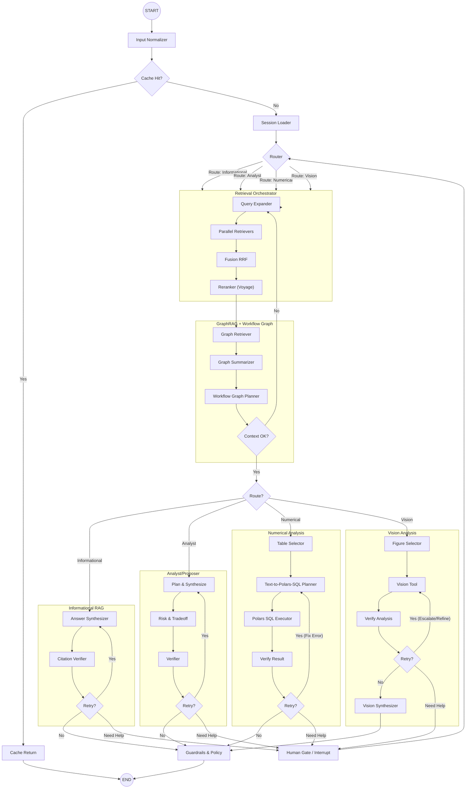

# Detailed Agent Design: LangGraph Router & Subgraphs

## 1. Architecture Overview

This design implements a **Graph-based Agent** using **LangGraph**, adhering to the "Router -> Subgraph" architecture. The system is designed for high determinism, explicit control flow, and robust state management.

### Core Principles
- **Explicit Control**: No "black box" agent loops. Every transition is defined by edges.
- **State Isolation**: Subgraphs have their own state schemas, inheriting from the parent state where necessary.
- **Persistence**: `MemorySaver` (or a persistent DB checkpointer) is used to save state at every super-step, enabling "time travel" and human-in-the-loop (HITL).
- **Parallelism**: Retrieval operations run in parallel using LangGraph's `Send` API or parallel branches.
- **Resilience & Self-Correction**: Every subgraph includes explicit **verification** and **retry** loops.
- **Smart Human-in-the-Loop (HITL)**: The agent can **dynamically interrupt** execution at any point (via a `HumanGate` node or `interrupt` function) when it detects ambiguity, low confidence, or missing information, resuming exactly where it left off after user input.
- **Graph Memory**: A GraphRAG layer maintains an entity/relationship graph plus workflow graphs so Analyst/Numerical routes can reason over patterns, dependencies, and proven troubleshooting sequences rather than only flat chunks.

## 2. Graph Diagram



## 3. Component Details

### 3.1. State Schema

We use `TypedDict` for strict typing.

```python
from typing import TypedDict, List, Optional, Any, Annotated
import operator
from langgraph.types import interrupt

class AgentState(TypedDict):
    # Conversation & Context
    messages: Annotated[List[Any], operator.add]
    conversation_id: str
    thread_id: str
    country_code: Optional[str]
    doc_version_ids: List[str]
    scope_hash: str
    
    # Routing & Control
    route: str # 'informational', 'analyst', 'numerical', 'vision'
    route_confidence: float
    loop_counter: int
    retry_counter: int # For self-correction loops
    error_log: List[str] # Track errors for reflection
    interrupts: List[Any]
    deadlines: dict # per-phase timeout metadata
    
    # Retrieval Artifacts
    raw_candidates: List[Any]
    fused_candidates: List[Any]
    reranked_candidates: List[Any]
    final_context: List[Any]
    retrieval_metrics: dict # latency, k, repairs, relaxations
    cache_key: str
    cache_hit: bool
    
    # Graph Reasoning
    graph_context: List[Any]
    workflow_plan: Optional[dict]
    workflow_plan_version: Optional[str]
    
    # Tool Results
    sql_query: Optional[str]
    sql_result: Optional[Any] # Polars DataFrame or list of dicts
    vision_analysis: Optional[str]
    
    # Final Output
    answer: str
    citations: List[dict]
    quality_score: float
    
    # Rate limiting & telemetry
    rate_limiter_permits: List[dict]
    token_usage: dict
```

`graph_context` caches entity/relationship clusters, graph summaries, and community-level metadata returned by the GraphRAG layer, while `workflow_plan` holds the synthesized workflow-graph steps (high/mid/low granularity) that downstream subgraphs replay or refine.

### 3.2. Nodes & Logic

#### **InputNormalizer**
- **Function**: `normalize_input(state: AgentState) -> AgentState`
- **Logic**: Cleans user input, extracts metadata (country code), and kicks off document-scope resolution:
    1. Query curated base documents for the detected `country_code`.
    2. Load `conversation_documents` (with `visibility_override`) for the `thread_id`.
    3. Merge explicit attachments from the request payload.
    4. Filter out `visibility="hidden"`, mark `read_only` docs for numerical guardrails, and persist new links / ref-count updates.
    5. Compute `scope_hash = hash(sorted(doc_version_ids + visibility states))` and stash it in state for cache and telemetry.
- **Cache Key**: After normalization, compute `cache_key = hash(country_code, normalized_prompt, scope_hash, route_hint, tool_parameters, retrieval_parameters)` and set `state["cache_hit"]` if Valkey already stores a finalized answer matching that key.
- **Tools**: None (Pure logic).

#### **Router**
- **Function**: `route_request(state: AgentState) -> dict`
- **Logic**: Uses **GPT-5-mini** to classify intent.
- **Output**: Updates `route` and `route_confidence`.

#### **Retrieval Orchestrator (Subgraph)**
This is a crucial component handling the "RAG" part.

1.  **ParallelRetrievers**:
    -   **Logic**: Fans out to 4 retrievers: Text (Vector), Table (Vector), Image (Vector), Keyword (BM25/TSQuery).
    -   **Implementation**: Use `langgraph.constants.Send` to trigger parallel nodes if they are separate, or a single node running `asyncio.gather`.
    -   **Voyage AI Integration**:
        ```python
        import voyageai
        vo = voyageai.Client()
        # Embed query
        query_emb = vo.embed([query], model="voyage-3.5-lite").embeddings[0]
        # Search pgvector with query_emb
        ```

2.  **Fusion (RRF)**:
    -   **Logic**: Combines results using Reciprocal Rank Fusion.
    -   **Formula**: `score = sum(1 / (k + rank_i))` where `k=60`.

3.  **Reranker**:
    -   **Logic**: Re-scores top N candidates using Voyage AI.
    -   **Voyage AI Integration**:
        ```python
        reranking = vo.rerank(
            query, 
            documents=[doc.text for doc in candidates], 
            model="rerank-2.5-lite", 
            top_k=10
        )
        # Update state with reranking.results
        ```

4.  **GraphRAG + Workflow Graph**:
    -   **GraphRetriever** queries the pre-built knowledge graph (entity + relationship store with community detection) using the user prompt, reranked hits, and document scope to pull the most relevant nodes/edges.
    -   **GraphSummarizer** distills those neighborhoods into structured `graph_context` payloads (per-entity facts, cross-document narratives, freshness metadata) that ride alongside `final_context`.
    -   **WorkflowPlanner** maps the active query onto a workflow graph catalog (coarse→fine troubleshooting sequences) to produce a `workflow_plan` with explicit steps, preconditions, and tool affordances. Analyst/Numerical routes can reuse the plan directly or refine it with HITL feedback.
    -   Graph artifacts persist in state so downstream nodes consume them deterministically and caches stay valid.
    -   Operational guardrails:
        -   Run nightly **Leiden/Louvain community detection** plus **dynamic PageRank** so GraphRetriever can bias toward influential nodes and fresh clusters (see Memgraph GraphRAG guidance).
        -   Multi-hop traversals are capped (e.g., 3 hops) unless the workflow plan explicitly demands deeper exploration, preventing runaway queries.
        -   `workflow_plan_version` and graph `algo_version` are embedded in the cache key to guarantee deterministic replay when graph schemas or prompts change.
    -   Every traversal records `retrieval.latency_ms`, `retrieval.hybrid_k`, `retrieval.repairs`, and `schema_relaxations` into `state["retrieval_metrics"]`, which the SSE `metrics` event forwards verbatim.

#### **Numerical Subgraph (Polars SQL)**
Designed for safe, sandboxed data analysis with **self-correction** and **HITL**.

1.  **TableSelector**: Selects the relevant table artifact from retrieved context.
2.  **TextToSQL**:
    -   **Logic**: **GPT-5-mini** translates natural language to a **Polars SQL** query.
    -   **Prompting**: "Write a Polars SQL query to answer... Schema: ... Previous Error: {error_log}"
3.  **ExecuteSQL (Polars Executor)**:
    -   **Logic**: Executes the query using `pl.SQLContext` over **lazy** sources (`scan_parquet`, `scan_csv`, or pre-materialized LazyFrames) so Polars can optimize before materialization.
    -   **Safety & Concurrency**:
        -   Register *only* the selected table(s) as lazy frames.
        - Offload execution with `await asyncio.to_thread(ctx.execute, query)` (or Polars' `collect_async()`) so CPU/IO work never blocks the LangGraph event loop, per `system_architecture.md §2.2.6`.
        -   **No `eval()`**. The query is parsed by Polars' SQL engine.
    -   **Implementation**:
        ```python
        import polars as pl
        async def execute_sql(query: str, table_sources: dict[str, pl.LazyFrame]):
            try:
                ctx = pl.SQLContext()
                for alias, lf in table_sources.items():
                    ctx.register(alias, lf)
                result = await asyncio.to_thread(lambda: ctx.execute(query, eager=True).to_dicts())
                return result
            except Exception as e:
                return {"error": str(e)}
        ```
4.  **SQLVerifier**:
    -   **Logic**: Checks if result is an error or empty.
    -   **Edge**:
        -   If Error/Empty AND `retry_counter < MAX_RETRIES`: -> `TextToSQL` (with error added to state).
        -   If `retry_counter >= MAX_RETRIES`: -> **HumanGate** (Ask user for clarification or manual query correction).
        -   Else: -> `Guardrails` (with failure message).

#### **Informational Subgraph**
1.  **AnswerSynthesizer**: Generates answer with citations using **GPT-5-mini**.
2.  **CitationVerifier**:
    -   **Logic**: Checks if citations match source text.
    -   **Edge**:
        -   If Invalid AND `retry_counter < MAX_RETRIES`: -> `AnswerSynthesizer` (with "Fix citation" prompt).
        -   Else: -> `Guardrails`.

#### **Vision Subgraph**
1.  **VisionTool**: Analyzes image using **GPT-5-mini** (or **GPT-5-nano** for low detail).
2.  **VisionVerifier**:
    -   **Logic**: Checks confidence score.
    -   **Edge**:
        -   If Low Confidence AND `retry_counter < MAX_RETRIES`: -> `VisionTool` (Escalate to stronger model).
        -   If `retry_counter >= MAX_RETRIES`: -> **HumanGate** (Ask user to identify figure).
        -   Else: -> `VisionSynthesizer`.

#### **CacheReturn**
-   **Purpose**: On cache hit, short-circuit execution and return the cached answer/citations/metrics. Cache entries are keyed by `hash(country_code, normalized_prompt, scope_hash, route, tool_parameters, retrieval_parameters, workflow_plan_version)` so replays remain deterministic and audit-friendly.
-   **State Effects**: Populate `answer`, `citations`, `quality_score`, set `cache_hit=True`, and emit the same telemetry payload (metrics + document_scope) as a fresh run would.

### 3.3. Edges & Conditional Logic

-   **`conditional_edge(Router)`**:
    -   If `route == 'informational'` -> `RetrievalOrchestrator`
    -   If `route == 'numerical'` -> `RetrievalOrchestrator` (needs data first)
    
-   **`conditional_edge(WorkflowPlanner)`**:
    -   If fused/reranked coverage or `graph_context` coherence falls below thresholds, loop back to `QueryExpander` (optionally forcing HyDE or keyword-only retrieval) so the knowledge graph can be repopulated.
    -   Else -> `SubgraphRouter` (directs to specific analysis subgraph with both vector and graph context in state)

### 3.4. Smart Human-in-the-Loop (HITL)

We use LangGraph's `interrupt` function to pause execution when the agent needs help.

```python
from langgraph.types import interrupt

def human_gate(state: AgentState):
    # This node is triggered when the agent is stuck
    question = "I am stuck. " + state.get("error_log", ["Unknown error"])[-1]
    
    # Pause execution and wait for user input
    user_input = interrupt(question)
    
    # Resume with user input
    return {
        "messages": [HumanMessage(content=user_input)],
        "retry_counter": 0 # Reset retries
    }
```

**Triggers**:
1.  **Ambiguity**: Router confidence < 0.5.
2.  **Stuck Loop**: `retry_counter` exceeds limit in any subgraph.
3.  **Missing Data**: Retrieval returns 0 results after expansion.

### 3.5. Rate Limiting & Token Counting

To ensure compliance with global quotas and prevent throttling, all LLM nodes integrate with the **Centralized Rate Limiter SDK** (backed by ElastiCache Valkey).

**Workflow per Node**:
1.  **Estimate**: Before calling the LLM, the node calculates `estimated_tokens` using `tiktoken` (Input + Expected Output + Safety Margin).
2.  **Acquire**: The node calls `await limiter.acquire("gpt-5-mini", tokens=estimated_tokens)`.
    -   **If Available**: Returns immediately.
    -   **If Exhausted**: The SDK **asynchronously sleeps** (`await asyncio.sleep(retry_after)`) until tokens replenish or the specific `retry-after` window passes. This pauses *only* the current graph branch, allowing other parallel branches to proceed if they use different buckets or have permits.
3.  **Execute**: The LLM call is made.
4.  **Adjust**: After the call, `limiter.update_usage(actual_tokens)` corrects the bucket balance based on the real usage headers.

```python
async def llm_node(state: AgentState):
    # 1. Estimate
    prompt = construct_prompt(state)
    est_tokens = count_tokens(prompt) * 1.10 
    
    # 2. Acquire (Waits if needed)
    await rate_limiter.acquire(
        model="gpt-5-mini", 
        tokens=est_tokens, 
        priority="high" if state["route"] == "informational" else "normal"
    )
    
    # 3. Execute
    response = await llm.ainvoke(prompt)
    
    # 4. Feedback (Optional, if SDK supports exact adjustment)
    # rate_limiter.adjust(response.usage_metadata)
    
    return {"messages": [response]}
```

### 3.6. Status Reporting (SSE & Deterministic Templates)

To keep streaming predictable (and aligned with the limiter budgets), we swapped the nano-model summarizer for deterministic templates that describe each major phase while **reusing the existing SSE contract** (`meta`, `delta`, `tool_call`, `tool_result`, `metrics`, `done`) defined in `../interfaces/api_contracts.md`.

**Mechanism**:
1.  **Event Emission**: Nodes still emit LangChain events (`on_chain_start`, `on_tool_start`, etc.).
2.  **Interception**: `StatusCallbackHandler` maps well-known node names to short, pre-approved templates.
3.  **Parameterization**: Templates can include safe placeholders (e.g., `{route}`, `{tool_name}`) pulled directly from state/inputs so messages stay informative without requiring another model call.
4.  **Streaming**: Templates are surfaced inside the existing `metrics` payload as `status_text` plus optional `phase`, so the FastAPI gateway simply forwards standard `metrics` events without any protocol changes.

```python
STATUS_TEMPLATES = {
    "RetrievalOrchestrator": "Searching knowledge base (route={route})…",
    "GraphRetriever": "Linking evidence inside the knowledge graph…",
    "GraphSummarizer": "Summarizing graph neighborhoods…",
    "WorkflowPlanner": "Assembling workflow plan ({plan_len} steps)…",
    "ExecuteSQL": "Running secure data analysis…",
}

class StatusCallbackHandler(BaseCallbackHandler):
    async def on_chain_start(self, serialized: Dict[str, Any], inputs: Dict[str, Any], **kwargs: Any) -> None:
        name = serialized.get("name")
        template = STATUS_TEMPLATES.get(name)
        if template:
            metrics_payload = {
                "status_text": template.format(
                    route=inputs.get("route", "informational"),
                    plan_len=len(inputs.get("workflow_plan", []) or []),
                ),
                "phase": name,
            }
            yield {"type": "metrics", "content": metrics_payload}
```

**Integration**:
```python
async for event in agent.astream_events(inputs, version="v1"):
    if event["event"] == "on_custom_event" and event["name"] == "status_update":
        # convert to canonical metrics SSE frame
        status_event = {"metrics": event["data"]}
        yield f"data: {json.dumps({'type': 'metrics', 'content': status_event})}\n\n"

# Each `metrics` frame bundles:
# - retrieval.latency_ms (per channel + total)
# - retrieval.hybrid_k
# - retrieval.repairs / schema_relaxations
# - document_scope snapshot (base vs user doc_ids + visibility)
# - cache metadata (cache_key, cache_hit)
# - rate limiter waits (per model)
# - optional status_text describing current phase
```

### 3.7. Service Interface (FastAPI + LangServe)

The FastAPI gateway and the LangGraph executor now live in the same ASGI process, exposed through **FastAPI** augmented with **LangServe**.

**Why this stack?**
-   **FastAPI**: Native `async` support (crucial for concurrent LLM calls), high performance, and auto-generated OpenAPI docs.
-   **LangServe**: A specialized library that wraps LangGraph executables into standard REST API routes. It handles:
    -   **Streaming**: Native support for `astream_events` (SSE).
    -   **Batching**: Automatically handles concurrent requests.
    -   **Playground**: Provides a debug UI at `/playground`.

**Implementation**:
The service runs as a standalone FastAPI container/process, listening on an internal port (e.g., 8000) and fronted by an ALB or API Gateway HTTP API. Because the FastAPI router already fronts the public interface, no separate Go proxy is required—the `/agent` streaming endpoint is mounted directly in FastAPI.

```python
from fastapi import FastAPI
from langserve import add_routes
from graph import graph # The compiled LangGraph

app = FastAPI(title="Vizonomy Agent Service")

# 1. Standard Agent Routes (Invoke, Stream, Batch)
add_routes(
    app,
    graph,
    path="/agent",
    enabled_endpoints=["invoke", "stream_events"], # We focus on streaming
)
```

**Scalability**:
-   **Stateless**: The service itself is stateless (state is persisted in Postgres/Redis via the Checkpointer).
-   **Horizontal Scaling**: You can run N replicas of this FastAPI container behind a load balancer.
-   **Async**: One process can handle hundreds of concurrent waiting agents (awaiting LLM tokens or user input).

### 3.8. Evaluation & Testing Strategy

To ensure reliability and high quality, we implement a tiered testing strategy using **pytest** and **LangSmith**.

#### **Tier 1: Unit Tests (Deterministic)**
Test individual nodes and tools in isolation using mocks.
-   **Tools**: Test `TextToSQL` prompt generation, `ExecuteSQL` safety checks (mocking Polars), and `InputNormalizer`.
-   **Nodes**: Test `Router` logic with mock LLM responses to ensure it outputs correct state updates.

```python
# tests/unit/test_nodes.py
def test_router_node():
    mock_llm = Mock(return_value=AIMessage(content="informational"))
    state = {"messages": [HumanMessage("Hello")]}
    result = router_node(state, llm=mock_llm)
    assert result["route"] == "informational"
```

#### **Tier 2: Integration Tests (Subgraphs)**
Test the flow within specific subgraphs (e.g., Numerical, Vision) using recorded fixtures or cached LLM responses.
-   **Goal**: Verify that `TextToSQL` -> `ExecuteSQL` -> `SQLVerifier` loop works correctly.
-   **Method**: Use `langgraph.prebuilt.create_react_agent` or manual graph execution with a `MemorySaver` checkpointer to inspect state transitions.

#### **Tier 3: End-to-End Evaluation (LangSmith)**
Evaluate the full agent against a "Golden Dataset" of diverse queries.

**Dataset Structure**:
-   `input`: User query (e.g., "What is the GDP of Brazil?")
-   `expected_output`: Ground truth answer.
-   `expected_route`: "numerical"
-   `required_tool`: "ExecuteSQL"

**Metrics**:
    1.  **Correctness (LLM-as-a-Judge)**: Use GPT-5-turbo (judge mode) to grade if the `actual_output` matches `expected_output`.
2.  **Tool Usage**: Did it call the correct tool? (Exact match on `required_tool`).
3.  **Latency**: Time to first token and total duration.
4.  **Resilience**: Count of `retry_counter` > 0 events (did it need to self-correct?).

**Implementation**:
```python
from langsmith import Client
from langchain.evaluation import load_evaluator

client = Client()

def evaluate_agent(run, example):
    # 1. Check Route
    predicted_route = run.outputs["route"]
    score_route = 1 if predicted_route == example.outputs["expected_route"] else 0
    
    # 2. Check Correctness
    evaluator = load_evaluator("labeled_criteria", criteria="correctness")
    res = evaluator.evaluate_strings(
        prediction=run.outputs["answer"],
        reference=example.outputs["expected_output"],
        input=example.inputs["input"]
    )
    score_correct = res["score"]
    
    return {"score_route": score_route, "score_correct": score_correct}

# Run evaluation
client.run_on_dataset(
    dataset_name="vizonomy-golden-v1",
    llm_or_chain_factory=build_agent,
    evaluation=evaluate_agent,
)
```

## 4. Library Specifics & Best Practices

### **LangGraph**
-   **Checkpointer**: Use `MemorySaver` for development, `PostgresSaver` (async) for production.
    ```python
    from langgraph.checkpoint.memory import MemorySaver
    checkpointer = MemorySaver()
    graph = builder.compile(checkpointer=checkpointer)
    ```
-   **Subgraphs**: Define subgraphs as their own `StateGraph` and add them as nodes to the parent graph. This encapsulates logic and keeps the main graph clean.
    ```python
    # Subgraph definition
    sub_builder = StateGraph(SubgraphState)
    ...
    subgraph = sub_builder.compile()
    
    # Parent graph
    builder.add_node("retrieval_subgraph", subgraph)
    ```

### **Voyage AI**
-   **Models**: `voyage-3.5-lite` (embeddings), `rerank-2.5-lite` (reranking).
-   **Batching**: Always batch embedding requests if possible, though for single-user queries, batch size 1 is fine.
-   **Truncation**: Enable `truncation=True` in `rerank` to avoid errors with long contexts.

### **Polars**
-   **SQL Context**: Use `pl.SQLContext` for a SQL-like interface. It supports a subset of ANSI SQL and is highly optimized.
-   **Lazy Execution**: Prefer `scan_parquet` or `scan_csv` registered to the context for memory efficiency, calling `collect()` only on the final result.

## 5. Next Steps for Implementation
1.  **Setup Environment**: Install `langgraph`, `langchain`, `voyageai`, `polars`.
2.  **Define State**: Create `state.py` with `AgentState`.
3.  **Implement Nodes**: Create `nodes/` directory.
    -   Implement `router.py` with LLM call.
    -   Implement `retrieval.py` with Voyage AI client.
    -   Implement `tools.py` with Polars SQL wrapper.
4.  **Build Graph**: Create `graph.py` wiring nodes and edges.
5.  **Test**: Run with `MemorySaver` and mock data.
