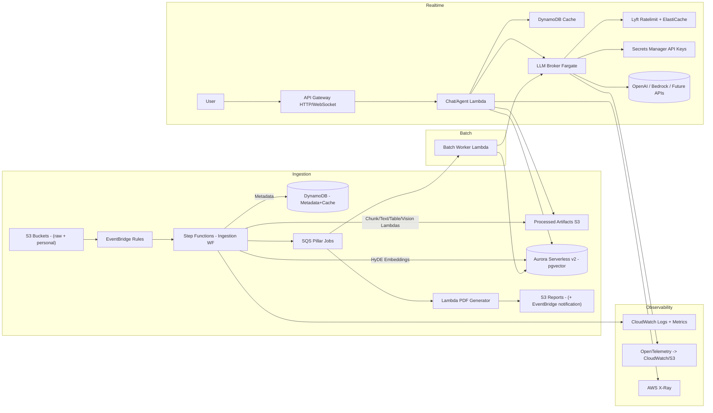

# RAG & Agentic System Blueprint

## Architectural Checklist
- Align workload goals, SLAs, and <$200/month cloud & LLM budget across chat versus batch personas.
- Partition ingestion, broker, and serving planes with AWS-native boundaries and minimal services.
- Select storage/compute primitives that balance retrieval quality with low operational overhead.
- Engineer an LLM traffic broker plus global limiter with priority lanes and future API key rotation.
- Define agent/tool stack, evaluation harness, and observability baselines sized for a 3-developer team.

## System Overview
- Microservice boundary: `rag-core` owns ingestion, retrieval, agent orchestration, and evaluation; user auth/portal remains an external concern.
- Control plane: AWS Step Functions Standard workflow orchestrates ingestion; EventBridge propagates change events; SQS provides async fan-out for pillar processing.
- Data plane: S3 for raw/processed artifacts, Aurora Serverless v2 (PostgreSQL + pgvector) for vectors and structured results, DynamoDB for metadata plus response cache.
- LLM access plane: Fargate-based broker (FastAPI/Python) fronted by API Gateway, backed by Lyft `ratelimit` service with ElastiCache Redis and AWS Secrets Manager for key rotation. The FastAPI surface is now the long-term plan; a Go rewrite is optional and deferred unless concurrency pressures force it.
- Serving plane: Lambda (Python) multi-agent orchestrator exposed through API Gateway HTTP/WebSocket; DynamoDB-backed response cache; optional WebSocket streaming.

---

## Part A – Architecture & Data Flow

### A1. Ingestion Orchestration
- Pattern: Event-driven AWS Step Functions Standard workflow per document with `Map` state (max concurrency 5) for page/section fan-out. Standard WF chosen over Kinesis or Spark for lower cost (<$0.30 per 10k transitions) and strong AWS-native observability (execution history, CloudWatch metrics).
- Workflow stages:
  1. **Preflight Lambda** validates MIME, routes shared vs personal docs, inserts metadata stub into DynamoDB.
  2. **Text Extraction**: Amazon Textract AnalyzeDocument for PDFs (tables, forms); LibreOffice-on-Lambda container handles Office formats.
  3. **Semantic Chunking Lambda**: recursive chunking with LlamaIndex `SentenceSplitter` (~400 tokens) and S3 write of chunk JSON (`processed/` prefix).
  4. **Table Formatter Lambda**: converts Textract tables to Markdown (single block) plus JSON artifact; references persisted in DynamoDB.
  5. **Image Analysis Lambda**: Bedrock Claude 3 Haiku vision captions; images stored in S3 `images/`, captions attached to chunk metadata.
  6. **HyDE Embedding Lambda**: generates hypothetical abstracts (Claude Haiku) then calls Bedrock Titan Embeddings G1 for vectors; batch UPSERT into Aurora `chunks` table using `pgvector`.
  7. **Pillar Question Fan-out**: posts document ID to SQS `pillar-jobs` queue for asynchronous recomputation.
- Guardrails: Step Functions concurrency cap plus optional SQS buffering prevent ingestion bursts from exhausting LLM quotas; each Lambda reports CloudWatch metrics (duration, success) and structured logs.

### A2. Data Storage Strategy

| Need | Options | Pros | Cons | Decision |
| --- | --- | --- | --- | --- |
| Vector store | OpenSearch Serverless | Managed ANN, serverless | >$350/month minimum; over budget | ❌ |
|  | Aurora Serverless v2 + pgvector | Low idle cost (~$45/month at 0.5-1 ACU), SQL joins, transactional writes | Requires tuning for ANN (ivfflat) | ✅ |
|  | DynamoDB vector | Serverless | Limited ANN maturity | ❌ |

- Aurora Schema: `documents`, `chunks(id, doc_id, embedding vector(1536), metadata jsonb, chunk_text)`, `pillar_answers`, `response_cache`.
- Ops: auto-pause disabled to keep under 10s latency; scale 0.5–2 ACU; weekly maintenance window.
- DynamoDB single-table design (`pk`, `sk` pattern) stores metadata, chat history, response cache (`TTL=86400`). Streams trigger cache invalidation Step Function on doc updates.
- S3: `raw/`, `processed/`, `images/`, `reports/` prefixes; bucket encryption (SSE-KMS), lifecycle to Standard-IA after 30 days.
- Validation: Combined Aurora + Dynamo + S3 spend ≈ $56/month; durable, low-admin footprint.

### A3. Real-Time API Layer
- Entry: Amazon API Gateway HTTP API (REST endpoints) plus WebSocket API for streaming completions.
- Compute: AWS Lambda (Python 3.12 container, 1 GB memory). Concurrency reserved at 10 for steady latency; overall limit 50 to guard costs.
- Flow:
  1. Validate request → fetch user doc scope (future integration).
  2. Router agent selects downstream agent; conversation context loaded from DynamoDB.
  3. Agent orchestrator executes LlamaIndex workflow (async) with tool calls routed through broker.
  4. Response cached in Dynamo keyed by hash of (prompt, doc IDs, tool outputs); cache hit short-circuits LLM.
  5. Conversation transcripts summarised nightly via Step Functions to control context size.
- Rationale: Lambda + API Gateway offers pay-per-use economics (<$15/month for ~50k invocations) and integrates with IAM authorizers; Python handles LlamaIndex natively.

### A4. PDF Reporting Pipeline
- Trigger: `pillar-jobs` queue message post ingestion or doc update.
- Worker: Containerized Lambda running Headless Chromium + WeasyPrint renders templated PDF (Jinja2 template) using data from Aurora and assets from S3.
- Output: PDF stored in `reports/` prefix, EventBridge rule emits notification (SNS/email or webhook) when done.
- Asynchronous design prevents blocking ingestion; compute cost negligible (<$2/month for 100 reports).

---

## Part B – Rate Limiting & Traffic Prioritization

### B1. Throttle (Ingestion Safeguards)
- Step Functions `Map` `MaxConcurrency=5` limits simultaneous doc processing.
- Optional SQS buffer (`ingestion-tasks`) with Lambda consumer concurrency pinned to 5 for additional smoothing.
- Batch recomputation uses SQS with per-message delay to stagger load after document bursts.

### B2. Lock (Global LLM Counters)
- Adopt Lyft `ratelimit` OSS service deployed on AWS Fargate; Redis backend provides atomic token buckets.
- Redis tier: ElastiCache t4g.micro in single-AZ (~$12/month). Descriptor dimensions: `(provider, model, priority)` with 60-second and 1-second windows.
- Rate profiles stored in DynamoDB (`rate_profiles` table). Ratelimit sidecar polls config every 30 seconds; updates possible without redeploy.
- Provides distributed RPM/TPM accounting for both real-time and batch clients.

### B3. Broker (Priority & Key Rotation)
- Broker microservice: FastAPI app (Python) on ECS Fargate (0.25 vCPU, 0.5 GB; ≈$9/month) behind internal API Gateway or NLB.
- Responsibilities:
  - Sync/async endpoints for real-time and batch traffic.
  - Call Lyft `ratelimit` before dispatch; if tokens unavailable, enqueue to `broker-deferred` SQS (for batch) or return retry for realtime.
  - Weighted capacity reservation (e.g., 70% tokens reserved for realtime descriptors); implements load shedding (429) when limits reached.
  - Multi-key rotation: keys stored in Secrets Manager (`/rag/llm/openai/<slot>`). Broker polls secrets; DynamoDB `llm_keys` table stores per-key quotas and cooldown state.
  - Provider-neutral HTTP clients (OpenAI, Bedrock, future). Observability via CloudWatch EMF metrics (quota usage, queue depth, latency).
- Failure handling: On provider 429/5xx, broker cools key via Dynamo TTL; real-time requests fail fast with descriptive error, batch requeues with jitter.
- Chosen over building custom limiter to minimize engineering overhead while delivering proven, maintainable solution.

### OpenAI Rate-Limit Strategy
- Broker parses OpenAI rate-limit headers to adjust descriptors dynamically.
- Batch workloads process via deferred SQS when broker indicates `retry_after`.
- Consider FluxNinja Aperture or similar managed solutions later; current design meets needs while staying lightweight.

---

## Part C – Agentic & RAG System

### C1. Agent Framework
- Candidates: LangChain, LlamaIndex, custom.
- Decision: LlamaIndex (Python) for multi-agent orchestration, native HyDE utilities, function-tool abstractions, and streaming support (per Context7 documentation).
- Deployment: Packaged with Lambda container image; dependencies managed via Poetry + layer caching.

### C2. Tooling Stack
- **RAGTool**: Hybrid retrieval (pgvector semantic + BM25 fallback). Router agent optionally triggers HyDE query expansion before vector search. Results include chunk IDs for citation enforcement.
- **Polars SQL Executor**: Dedicated Lambda (or container) running Polars; input references S3 JSON artifact; tool enforces timeouts and returns deterministic JSON. Prompt injection supplies the constrained SQL grammar snippet.
- **CalculatorTool**: Restricted Python evaluator (e.g., `asteval` with safe namespace) for exact numerical results.
- **Text-to-Query Tool**: SQLGlot-backed translator enabling structured queries over tabular data snapshots stored in Aurora.
- Tools exposed via LlamaIndex `FunctionTool` wrappers; results logged for observability.

### C3. Multi-Agent Orchestration
- Router Agent (Claude 3 Haiku) classifies intents (`Informational`, `Analyst`, `Numerical`, `Upload`, `Other`).
- Informational RAG Agent: Single/multi-prompt chain ensures citations for each factual statement; uses response templating.
- Analyst/Proposer Agent: Leverages broader conversation context (summarised state) to generate recommendations or ideation.
- Numerical Agent: Prioritises `Polars SQL Executor`/`CalculatorTool`, includes verification steps before final answer.
- Execution: Lambda orchestrator runs asynchronous workflow; jobs exceeding 15s switch to Step Functions Express (callback pattern) and use WebSocket callback to deliver final response.

### C4. Pillar Question Engine & Reporting
- `pillar-jobs` Lambda reads question templates from Dynamo, executes deterministic RAG flow, and stores answers with provenance in Aurora.
- Document updates (S3 version change) trigger Step Functions to requeue affected pillar questions.
- PDF generator pulls latest answers, supporting versioned report history.

### C5. Evaluation & Testing
- Offline evaluation harness (CodeBuild or GitHub Actions runner):
  - LlamaIndex `EvaluatorSuite` or Ragas for faithfulness/context recall metrics.
  - Synthetic test sets covering informational, numerical, and proposal queries.
  - Thresholds (e.g., faithfulness ≥0.7) gate deployments.
- Load testing via Artillery hitting API Gateway to verify broker rate-limiting and priority handling.
- Observability: CloudWatch dashboards track ingestion success, broker token usage, cache hit rate, latency; alerts via SNS.

---

## Cost Envelope (Monthly Targets)

| Component | Estimate (USD) | Notes |
| --- | --- | --- |
| Aurora Serverless v2 (0.5–1 ACU avg) | 45 | PostgreSQL + pgvector, multi-AZ off initially |
| DynamoDB (metadata + cache) | 6 | On-demand, includes Streams |
| S3 storage & requests | 5 | ~200 GB raw + processed, lifecycle to IA |
| Step Functions + Lambda orchestration | 12 | Includes Standard WF usage |
| Amazon Textract | 20 | ~1,300 pages/month; fallback to OSS parsers when tables absent |
| Bedrock Claude 3 Haiku (vision + HyDE) | 30 | ~1M input + 200k output tokens |
| Bedrock Titan Embeddings G1 | 15 | ~6M tokens |
| API Gateway + Lambda (chat) | 15 | 50k invocations, streaming responses |
| Broker Fargate task | 9 | 0.25 vCPU/0.5 GB |
| ElastiCache Redis (rate limiter) | 12 | t4g.micro |
| Secrets Manager | 4 | Four API key secrets |
| CloudWatch / X-Ray | 6 | Logs, metrics, traces |
| PDF Lambda & storage | 2 | ~100 reports |
| **Total** | **181** | Leaves ≈$19 buffer for unforeseen LLM or data transfer spikes |

Budget validation: All core AWS + LLM costs remain under the $200/month ceiling with ≈10% headroom; CloudWatch Budgets alerts at 70% and 90%.

---

## Observability, Security, and Operations
- **Monitoring**: CloudWatch dashboards for Step Function success rates, broker queue depth, rate-limit saturation, cache hit ratio, Lambda latency. X-Ray tracing for ingestion and chat Lambdas. Embedded Metric Format from broker for Prometheus-style metrics.
- **Logging**: Structured JSON logs across Lambdas and broker; centralised CloudWatch Logs Insights queries; retention 30 days (extendable).
- **Security**: IAM least-privilege roles per service, KMS CMKs for S3 buckets and Aurora, VPC endpoints for private service communication, Secrets Manager rotation via Lambda (60-day cadence).
- **Deployment**: AWS CDK (Python or TypeScript) templates; CI/CD pipeline via CodePipeline or GitHub Actions with cross-account deploy capability.
- **Resilience**: Step Functions retries with exponential backoff, DLQs for ingestion Lambdas, broker health checks (Fargate). Load shedding ensures realtime lane protection as per Netflix/Stripe best practices.

---

## Extensibility & Open Questions
- Conversation memory depth TBD; default to rolling summary stored in Dynamo to balance latency and cost.
- Future LLM mix: design already provider-neutral; consider Bedrock Nova or Anthropic direct if pricing shifts.
- Scale-up path: if traffic grows, migrate broker and ingestion workers to autoscaled ECS services, enable Aurora read replicas, and introduce OpenSearch or MemoryDB if vector workloads exceed pgvector limits.
- Consider integrating managed solutions like FluxNinja Aperture for rate governance once traffic justifies added complexity.

---

## Next Steps
1. Bootstrap CDK stack for S3 → Step Functions → Aurora pipeline; benchmark chunking runtime and Textract spend.
2. Implement broker MVP (Fargate + Lyft ratelimit + Redis) and run synthetic load tests to validate rate limits and priority queues.
3. Scaffold LlamaIndex-based agents and tool wrappers (RAG, Polars SQL executor, calculator) inside Lambda container image.
4. Populate evaluation harness with baseline informational, numerical, and proposal questions; configure CI gating thresholds.
5. Configure AWS Budgets and CloudWatch alarms tied to the $200/month cap, plus incident playbooks for rate-limit exhaustion.
