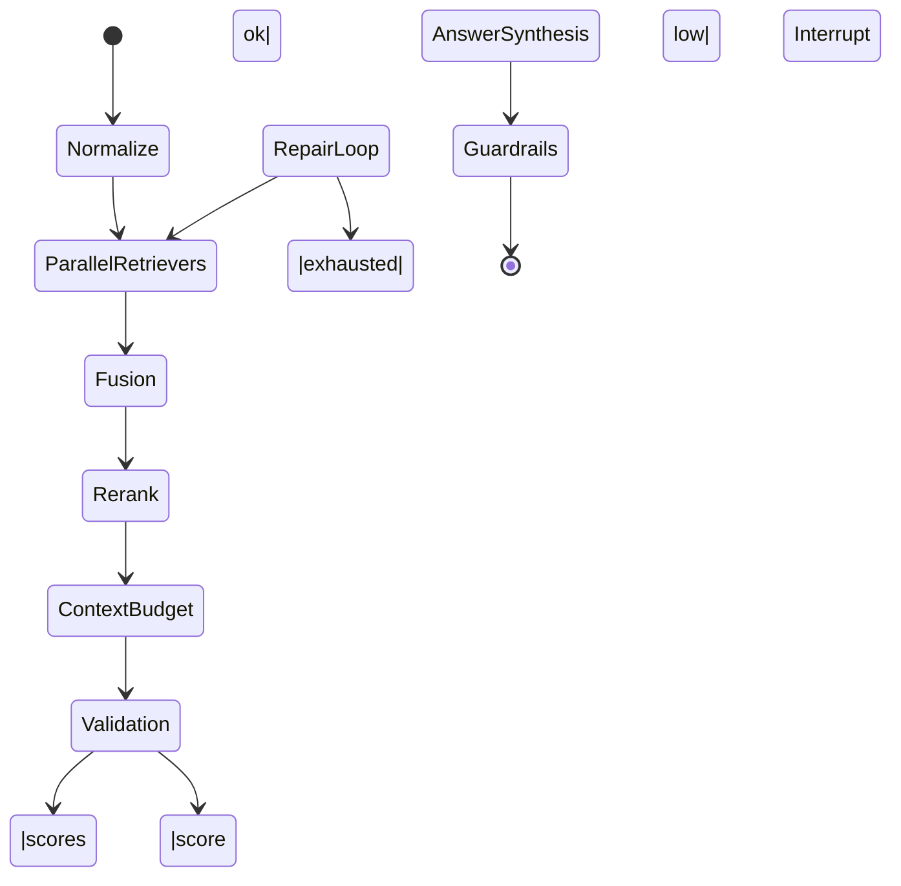

<!-- markdownlint-disable MD013 MD022 MD031 MD032 -->

# Retrieval & Agent Configuration Deep Dive

## 1. Objectives & Scope
- Translate the high-level guidance in [system_architecture.md §2.2](../overview/system_architecture.md#22-component-design) and §4.2 into concrete defaults, owning how they are stored, surfaced, and tuned.
- Define how every LangGraph route (Informational, Analyst/Proposer, Numerical, Vision) consumes retrieval outputs, including fallbacks, repair loops, and human-in-the-loop interrupts.
- Capture the policy that merges country base documents with user uploads through the `conversation_documents` bridge while respecting per-attachment `visibility_override`.
- Enumerate the metrics emitted at each phase so retrieval quality, cost, and latency can be governed.

## 2. Configuration Surface
### 2.1 Parameter categories
| Layer | Owner | Storage | Examples |
| --- | --- | --- | --- |
| Global defaults | Platform Eng | AWS AppConfig (`/retrieval/defaults`) cached in-process for 5 min | `hybrid_k=10`, `rrf_window=60`, `voyage_rerank_top_k=32`, `max_retrieval_loops=2` |
| Environment overrides | DevOps | AppConfig environment profiles (`dev`, `staging`, `prod`) | Lower `k` on dev (`hybrid_k=4`) to save spend; staging reranker top_k=16 |
| Route-specific | Agent team | LangGraph route registry YAML checked into repo | Informational route restricts tool calls to 2 per loop; Analyst route enables table retriever boost |
| Conversation/session overrides | Runtime | `conversation_documents` metadata + chat request `constraints` | `auto_attach_base_docs=false`, hidden attachment forcing `visibility="hidden"` |
| Experiment/feature flags | Experiment owner | Config table in Postgres (`retrieval_overrides`) keyed by `experiment_id` | Temporary increase of `rrf_window` for Liberia pilots |

### 2.2 Change workflow
1. Proposed changes authored as PRs to the YAML schema (validated via JSON Schema + unit tests).
2. CI deploys to AppConfig dev profile; integration tests replay canned conversations.
3. Promotion to staging/prod gated by automatic checks (latency delta ±5%, rerank success ≥ baseline) and manual approval.
4. Rollback uses AppConfig version pinning; LangGraph process watches for `etag` drift and hot-reloads.

## 3. Document Scope Resolution
### 3.1 Source taxonomy
| Source | Description | Default visibility |
| --- | --- | --- |
| Country base set | Curated docs per `country_code`; attached automatically when `constraints.auto_attach_base_docs=true` | `visible` |
| User uploads (private) | Documents owned by requesting `user_id` | `visible` |
| User shared | User uploads explicitly shared with another user or org alias | `visible` |
| Ephemeral attachments | One-off attachments included in a chat payload but not persisted | Mirrors payload |
| Hidden references | Attachments kept for auditing but excluded from retrieval | `hidden` |

### 3.2 Visibility semantics
- `visible`: Materialized into retrieval scope and eligible for citation.
- `hidden`: Stored in `conversation_documents` but filtered out unless a tool explicitly demands it (currently none do).
- `read_only`: Eligible for retrieval but agent must not mutate derived data (used for Numerical route to avoid writing back derived tables).
- `visibility_override` persists per `(conversation_id, document_id)`. Chat requests can temporarily flip visibility; flips are versioned with `updated_by` + timestamp for audits.

### 3.3 Resolution algorithm (pseudocode)
```text
resolve_scope(conversation_id, message):
  base_docs = query_base_docs(message.country_code)
  convo_docs = query_conversation_documents(conversation_id)
  request_docs = normalize(message.attachments)
  combined = union(base_docs, convo_docs, request_docs) by document_id
  for doc in combined:
    doc.visibility = last_non_null(doc.visibility_override_chain)
    if doc.visibility == 'hidden':
      continue
    if doc.visibility == 'read_only':
      mark_read_only(doc.document_id)
    attach_to_session(doc)
  persist_new_links(conversation_id, request_docs)
  emit_scope_metrics(conversation_id, combined)
```
- `query_base_docs` respects per-country feature flags so countries without curated packs skip auto-attach.
- `persist_new_links` increments the `conversation_documents.ref_count` so GC can reclaim once ref count hits zero.
- `emit_scope_metrics` pushes `documents_visible`, `documents_hidden`, `base_vs_user_ratio`, and `ref_count` deltas to CloudWatch.

### 3.4 Persistence & caching
- Scope materialization cached per `(conversation_id, message_id)` in Valkey (TTL 5 minutes) to prevent repeated DB hits for streaming retries.
- A stable `scope_hash` (sorted doc IDs + visibility) feeds the retrieval cache key noted in [system_architecture.md §4.3](../overview/system_architecture.md#43-cache-key-generation).

## 4. Query Lifecycle & Retrieval Controls
### 4.1 Preflight normalization
| Stage | Config knob | Default | Notes |
| --- | --- | --- | --- |
| InputNormalizer | `prompt_lowering`, `stopword_set` | `true`, ISO stopword list | Ensures deterministic cache keys. |
| QueryIntentClassifier | `model`=`GPT-5-mini`, `temperature=0.0` | Routes to Informational, Analyst, Numerical, Vision |
| QueryExpander | `max_alternates=2`, `beam_temperature=0.2` | Alternates used only when rerank scores fall below `0.35` |
| Guardrails | `pii_blocklist_version` | `v4` | Shared with ingestion pipeline. |

### 4.2 Parallel retrievers (RAGTool channels)
| Channel | Index & filters | `candidate_k` | `post_filter` | Notes |
| --- | --- | --- | --- | --- |
| Text semantic | `chunks.embedding` (pgvector ivfflat, cosine), filter on `doc_id`, `type='text'`, `country_code` | 120 | Score ≥ 0.25 | Primary relevance source; respects `max_page_span=2` during chunk stitching. |
| Table semantic | Same index, `type='table'` + `schema_summary` TSV | 80 | Score ≥ 0.3 | Boosts rows with high numeric density; results enriched with schema metadata. |
| Image caption | `type='image'`, embedding space from Voyage image encoder | 40 | Score ≥ 0.28 | Used mainly in Vision route; suppressed elsewhere unless query contains `figure`, `chart`, `map`. |
| Keyword search | `chunks.text_tsv @@ plainto_tsquery` | 60 | `ts_rank_cd ≥ 0.1` | Provides recall when embedding hits fail; feeds RRF even if semantic miss. |
- `candidate_k` trimmed to respect `max_tokens_context` (see §4.4). When chunk count exceeds limit, lowest `score` per channel dropped before fusion.

### 4.3 Fusion & reranking
| Stage | Config knob | Default | Behavior |
| --- | --- | --- | --- |
| Reciprocal Rank Fusion | `rrf_window=60`, `rrf_k=60`, `weight_keyword=1.2` | Derived from §4.2 of [system_architecture.md](../overview/system_architecture.md) | Ensures each channel contributes up to 60 hits; keyword gets slight boost to counter semantic blind spots. |
| Voyage reranker | Model `rerank-2.5-lite`, `top_k=32`, `truncation=true`, `context_limit=1024 tokens` | Hard limit to stay within SLA | Runs per fused result set; reranker score threshold `0.35`. |
| Context builder | `hybrid_k=10` final selections | Weighted by rerank score + freshness penalty (older than 6 months drop 0.02). |
| Cache layer | `cache_ttl_hours=48` (Valkey) | Cache key includes route, normalized prompt, scope hash, retrieval knobs | Hits skip retrievers and reranker entirely, returning cached `final_context`. |

### 4.4 Chunking & context budgeting
- Chunking inherits ingestion defaults (≈500 tokens, 50-token overlap). Metadata includes `section_title`, `page_num`, `bbox`.
- Context builder enforces `max_context_tokens=3_000` per tool call. If fused chunks exceed the budget:
  1. Drop chunks with rerank score <0.25.
  2. Collapse same-page siblings by merging and trimming overlap.
  3. As last resort, reduce `hybrid_k` to 8 (Informational) or 6 (Vision) and log `retrieval_budget_shrink=1`.

## 5. Repair, Fallbacks, and Interrupts
### 5.1 Thresholds
| Signal | Threshold | Action |
| --- | --- | --- |
| `min_fused_score` | 0.22 | Trigger QueryExpander alternate #1 and rerun retrievers. |
| `min_rerank_score` | 0.35 | Invoke keyword-only rerun with relaxed filters (`country_code` optional). |
| `citation_coverage` | ≥95% sentences covered | If <95%, run targeted repair (max 1) restricted to uncovered claims. |
| `repair_failures` | >1 | Raise `Interrupt(clarification)` to client. |

### 5.2 Flow

- `RepairLoop` increments `retrieval_loop_count` and stops at `max_retrieval_loops=2` (from design doc §4.2). Keyword-only rerun uses `candidate_k=40` and disables `score ≥0.3` gate.
- Schema relaxation: when table retriever fails, drop `country_code` filter but keep `doc_id` and `type='table'`. Logged as `schema_relaxation=1` for analytics.
- Human-in-the-loop: Router raises interrupt if all loops fail or if agent confidence <0.4; resume re-enters at `ParallelRetrievers` using clarified prompt.

## 6. Agent Route Configuration
### 6.1 Informational RAG
- Uses all four retriever channels with default weights.
- `hybrid_k=10`, `max_tool_calls=2`, `max_tokens_answer=900`.
- Requires citation coverage 100% before finalizing; verification failure triggers the single repair loop.

### 6.2 Analyst / Proposer
- Boosts table retriever weight to 1.3 and image channel to 0.8 to favor quantitative evidence.
- Allows `hybrid_k=12` to surface more context for synthesis.
- Numerical subgraph auto-invoked when reranker surfaces ≥1 chunk tagged `contains_numeric=true`.
- Tool sequence: Retrieval → AnalystChain (LLM) → optional PolarsSQLTool → synthesis. `max_tool_calls=4`.

### 6.3 Numerical Route
- Skips general synthesis until PolarsSQLTool validates query plan.
- Retriever channels limited to text + table (`candidate_k=60/60`). Keyword channel disabled unless rerank score <0.3.
- Context builder produces structured payload: `tables`, `column_stats`, `units`. Each Polars execution logs SQL, runtime, row count.

### 6.4 Vision Route
- Image channel weight 2.0, `candidate_k=60`; text/table channels set to `candidate_k=30` for captions surrounding figures.
- VisionTool decides caption detail (low vs high) based on rerank confidence. If <0.4, escalate to GPT-5-mini vision call.
- Requires figure citations referencing `artifact_uri` and page.

## 7. Metrics & Score Emission
| Metric | Description | Dimensions |
| --- | --- | --- |
| `retrieval.latency_ms` | Time from QueryExpander start to rerank finish | `route`, `channel`, `loop_index` |
| `retrieval.hybrid_k` | Final context count | `route`, `cache_hit` |
| `retrieval.score.fused_avg` | Mean fused score per call | `route`, `loop_index` |
| `retrieval.score.rerank_avg` | Mean reranker score | Same |
| `retrieval.repairs` | Count of repair loops executed | `route` |
| `retrieval.schema_relaxations` | Boolean metric for filter relax | `route`, `country_code` |
| `scope.documents_visible` | Number of visible docs attached | `route`, `country_code`, `user_type` |
| `cache.hit_rate` | Share of retrieval cache hits | `route` |
| `interrupts.issued` | Number of human-in-the-loop requests | `route`, `reason` |

All metrics exported via OpenTelemetry, forwarded to CloudWatch and Grafana. SSE `metrics` event (see `api_event_contracts.md §1.3`) includes per-call snapshot: `retrieval`, `document_scope`, cache metadata.

## 8. Change Management & Validation
- **Static analysis**: CI lints YAML/JSON configs, ensuring all parameters match schema and stay within safe bounds (e.g., `hybrid_k` ≤ 16).
- **Replay harness**: Nightly job replays 200 canonical conversations per route; diffs `answer`, `citations`, `metrics`. Failures block promotion.
- **Canary flag**: `retrieval_overrides` table includes `canary_percent` to roll out changes to a subset of conversations; Router selects into canary via hash of `thread_id`.
- **Incident response**: On elevated `repair_failures`, toggle `retrieval_fail_safe=keyword_only` which bypasses semantic search but guarantees deterministic recall until embeddings recover.
- **Documentation**: Changes logged in `/docs/change_log/retrieval.md` with owner, rationale, blast radius, and rollback ID referencing AppConfig version.
