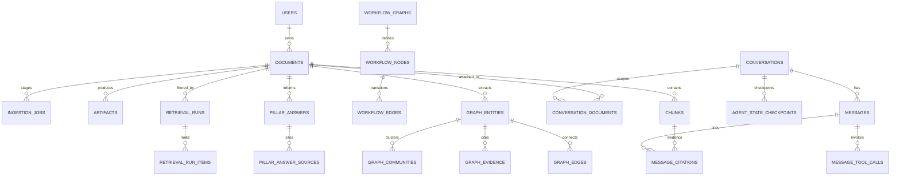

<!-- markdownlint-disable MD013 MD022 MD032 -->

# Database Schema & Persistence Rules Deep Dive

## 1. Design Principles

1. **Dual-scope corpus**: `base` documents (shared, country-scoped) live alongside `user` documents (private/shared). Access control derives from `conversation_documents` attachments rather than implicit ownership.
2. **Hash-based deduplication**: Every binary upload yields a `content_hash` (SHA-256). Per user, `(owner_user_id, content_hash)` is unique, so repeated uploads simply reattach existing docs.
3. **Ref-counted deletion**: Documents track `active_chat_refs`. Chat deletion decrements references; garbage collection removes user docs only when ref count hits zero. Base docs require admin UI and cannot be deleted while referenced.
4. **Snapshot fidelity**: All derived assets copy `content_hash` so provenance survives even when documents are shared.
5. **Deterministic replay**: Conversations, tool traces, and checkpoints retain enough state for LangGraph to resume from any node.
6. **Performance-aware retrieval**: Text/table/image chunks sit in a single table with vector + tsvector indexes plus metadata filters.
7. **Graph-first augmentation**: Knowledge-graph and workflow-graph materializations live alongside chunks so GraphRAG/workflow planning can remain deterministic and queryable inside Postgres.
8. **Minimal PII**: Store only `user_id` references; upstream tokens remain transient.
9. **Migration safety + observability**: Schema evolves additively with reversible migrations, tracked ref counts, and metrics for ingestion/deletion pipelines.

## 2. Logical Model Overview

| Domain | Core Tables | Purpose |
| --- | --- | --- |

| Document registry | `documents`, `ingestion_jobs`, `artifacts` | Track uploads (base + user), ingestion stages, and dedup metadata. |
| Conversation access | `conversation_documents` | Attach documents (base or user) to chats, maintain ref counts. |
| Retrieval corpus | `chunks`, `chunk_metrics` | Embeddable units keyed by `document_id` + `content_hash`. |
| Knowledge graph | `graph_entities`, `graph_edges`, `graph_evidence`, `graph_communities` | Persist entities/relationships derived during ingestion for GraphRAG. |
| Workflow playbooks | `workflow_graphs`, `workflow_nodes`, `workflow_edges`, `workflow_versions` | Store coarse/mid/fine troubleshooting paths consumed by WorkflowPlanner. |
| Conversations & checkpoints | `conversations`, `messages`, `message_tool_calls`, `message_citations`, `agent_state_checkpoints` | Persist LangGraph transcripts and evidence. |
| Async insights | `pillar_answers`, `pillar_answer_sources`, `retrieval_runs`, `retrieval_run_items` | Pre-computed answers and retrieval telemetry. |



## 3. Entity Definitions & Constraints

### 3.1 Identity

**Identity Management**
User identity is managed externally. The `shared_data_layer` stores `owner_user_id` as a raw UUID for scoping but does not maintain a `users` table or enforce foreign key constraints.


### 3.2 Document Lifecycle

**Table: documents** (single logical record per owner/base scope)

| Column | Type | Notes |
| --- | --- | --- |
| `id` | `uuid` | Primary key referenced by all downstream tables. |
| `owner_user_id` | `uuid` | Raw UUID provided by upstream identity service; nullable for base documents. |
| `access_scope` | `text` | Enum (`base`, `user_private`, `user_shared`). Determines default visibility. |
| `canonical_name` | `text` | Display name. Unique per user within active docs. |
| `country_code` | `char(3)` | Required for base docs; optional for user docs to enforce retrieval filters. |
| `language` | `text` | ISO 639-1. |
| `tags` | `text[]` | Metadata for filtering. |
| `status` | `text` | Enum (`registered`, `ingesting`, `active`, `failed`, `archived`). |
| `ingestion_stage` | `text` | Most recent completed stage. |
| `content_hash` | `text` | SHA-256 of normalized bytes; dedup key. |
| `source_uri` | `text` | S3 pointer to uploaded binary. |
| `byte_size` | `bigint` | For quotas and dedup heuristics. |
| `ingestion_started_at` / `ingestion_completed_at` | `timestamptz` | Stage timings. |
| `visibility` | `text` | Enum (`private`, `shared`, `base_admin`). Guides UI exposure. |
| `managed_by` | `text` | `user`, `system`, `admin`. Base docs typically `system`. |
| `active_chat_refs` | `integer` | Cached count maintained via trigger on `conversation_documents`. |
| `metadata` | `jsonb` | Department, confidentiality, etc. |
| `created_at` / `updated_at` / `deleted_at` | `timestamptz` | Audit + soft delete. |

Constraints & indexes:
- Unique `(owner_user_id, lower(canonical_name)) WHERE deleted_at IS NULL AND access_scope <> 'base'`.
- Unique `(owner_user_id, content_hash)` for user docs (owner not null).
- Unique `(access_scope, country_code, content_hash) WHERE access_scope='base'` ensures one base doc per country per hash.
- `CHECK (access_scope <> 'base' OR owner_user_id IS NULL)`.
- B-tree indexes on `(access_scope, country_code)` and `(status, updated_at)`; partial `(status) WHERE status IN ('ingesting','failed')`.

**Table: ingestion_jobs**

| Column | Type | Notes |
| --- | --- | --- |
| `id` | `uuid` | Primary key (Step Functions execution id). |
| `document_id` | `uuid` | FK → `documents`. |
| `stage` | `text` | Enum (`preflight`, `convert`, `chunk`, `embed`, `index`, `activate`). |
| `status` | `text` | Enum (`pending`, `running`, `succeeded`, `failed`, `canceled`). |
| `attempt` | `smallint` | Retry counter. |
| `worker` | `text` | Lambda/container identifier. |
| `last_error` | `jsonb` | Structured error payload. |
| `started_at` / `completed_at` | `timestamptz` | Stage timings. |
| `trace_id` | `uuid` | Correlates to distributed tracing. |

Indexes: `(document_id, stage)` plus partial `(status) WHERE status IN ('pending','failed')`.

**Table: artifacts**

| Column | Type | Notes |
| --- | --- | --- |
| `id` | `uuid` | Primary key. |
| `document_id` | `uuid` | FK → `documents`. |
| `artifact_type` | `text` | Enum (`markdown`, `table_json`, `figure_image`, `chunk_manifest`, `pdf_export`). |
| `s3_uri` | `text` | Storage location. |
| `byte_size` | `bigint` | Storage accounting. |
| `content_hash` | `text` | Copy of parent’s hash; used for integrity checks. |
| `page_range` | `int4range` | Optional. |
| `metadata` | `jsonb` | Schema summaries, figure tags. |
| `created_at` | `timestamptz` | Audit timestamp. |

Indexes: `(document_id, artifact_type)` and GIN on `metadata`.

### 3.3 Conversation Attachments

**Table: conversation_documents** (chat ↔ document mapping)

| Column | Type | Notes |
| --- | --- | --- |
| `conversation_id` | `text` | FK → `conversations`. |
| `document_id` | `uuid` | FK → `documents`. |
| `attached_by_user_id` | `uuid` | Raw UUID recording who attached the doc; null when auto-attached base docs. |
| `attach_source` | `text` | Enum (`base_auto`, `user_upload`, `admin_attach`). |
| `role` | `text` | Enum (`primary`, `supplemental`). |
| `visibility_override` | `text` | Enum (`visible`, `hidden`, `read_only`). |
| `created_at` | `timestamptz` | Attachment time. |
| `deleted_at` | `timestamptz` | Null unless detaching for audit. |

Primary key `(conversation_id, document_id)`. Triggers increment/decrement `documents.active_chat_refs` when rows insert/delete (ignoring soft deletes until hard removal). Indexes on `(document_id)` and `(attach_source)` support GC and analytics.

### 3.4 Retrieval Units

**Table: chunks**

| Column | Type | Notes |
| --- | --- | --- |
| `id` | `uuid` | Primary key (ULID from document + offset). |
| `document_id` | `uuid` | FK → `documents`; `ON DELETE CASCADE` when document garbage collected. |
| `content_hash` | `text` | Copy of parent doc hash. |
| `owner_user_id` | `uuid` | Denormalized for RLS. Null for base docs. |
| `country_code` | `char(3)` | Partition key. |
| `chunk_type` | `text` | Enum (`text`, `table`, `image`). |
| `page_number` | `integer` | Optional. |
| `section_path` | `text[]` | Hierarchical headings. |
| `position` | `integer` | Order within document. |
| `token_count` | `integer` | `CHECK (token_count <= 800)`. |
| `text_content` | `text` | Null for tables/images. |
| `text_tsv` | `tsvector` | Generated column for keyword search. |
| `schema_summary` | `text` | Table/image synopsis. |
| `table_payload` | `jsonb` | Normalized table data, queryable via Polars SQL. |
| `image_caption` | `text` | Caption text. |
| `bbox` | `jsonb` | `[x1,y1,x2,y2]`. |
| `embedding` | `vector(1024)` | Voyage 3.5-lite vector (normalized). |
| `metadata` | `jsonb` | Pillar tags, languages. |
| `owner_user_id` | `uuid` | Denormalized for RLS. Null for base docs. |
| `country_code` | `char(3)` | Partition key. |
| `section_path` | `text[]` | Hierarchical headings. |
| `bbox` | `jsonb` | `[x1,y1,x2,y2]`. |
| `text_tsv` | `tsvector` | Generated column for keyword search. |
| `table_payload` | `jsonb` | Normalized table data, queryable via Polars SQL. |
| `created_at` | `timestamptz` | Insert timestamp. |

Indexes: pgvector HNSW/IVFFlat on `embedding`; GIN on `text_tsv`; B-tree `(document_id, chunk_type, position)`; partial `(country_code, chunk_type)`; LIST partition by `country_code` (default partition for misc).

**Vector index guardrails**
- Normalized embeddings are compared with the negative inner product operator (`<#>`) for the best recall/latency tradeoff; cosine distance is reserved only when embeddings are not normalized, per the [pgvector README](https://github.com/pgvector/pgvector/blob/master/README.md).
- HNSW indexes are preferred for latency-sensitive search once tables exceed ~50k rows; IVFFlat remains an option for faster builds/lower memory, but must be created only after enough data exists for the configured `lists`, otherwise results will drop and the index should be dropped until the table grows (pgvector guidance).
- When IVFFlat is used, ops must document `lists`/`probes` defaults (e.g., `lists = rows/100`, `ivfflat.probes = lists/5`) and increase probes for filtered queries because filters execute after the ANN scan.
- Upgrades to pgvector or changes to the underlying embeddings require `REINDEX`/`DROP INDEX ... CREATE INDEX` to ensure IVFFlat captures all vectors; this is explicitly required when moving from 0.2.x to 0.3.x and for any future pgvector upgrades that change on-disk formats.
- Enable iterative index scans (`ivfflat.iterative_scan`, `hnsw.max_scan_tuples`) when combining ANN with heavy metadata filters so recall stays stable as tables grow.

**Table: chunk_metrics**

| Column | Type | Notes |
| --- | --- | --- |
| `chunk_id` | `uuid` | PK/FK → `chunks`. |
| `quality_score` | `numeric(3,2)` | QA-derived metric. |
| `retrieval_count` | `bigint` | Incremented asynchronously. |
| `last_seen_at` | `timestamptz` | Latest retrieval time. |
| `created_at` / `updated_at` | `timestamptz` | Audit columns. |

### 3.5 Pillar Answers & Sources

**Table: pillar_answers**

| Column | Type | Notes |
| --- | --- | --- |
| `id` | `uuid` | Primary key. |
| `owner_user_id` | `uuid` | Raw UUID from the calling service; required. |
| `country_code` | `char(3)` | Pillar scope. |
| `pillar_name` | `text` | Enum referencing `pillar_catalog`. |
| `document_id` | `uuid` | FK → `documents` (base or user). |
| `content_hash` | `text` | Snapshot for provenance. |
| `score` | `numeric(4,3)` | Optional normalized score. |
| `summary_markdown` | `text` | Assistant-facing response. |
| `answer_json` | `jsonb` | Structured payload. |
| `status` | `text` | Enum (`draft`, `running`, `published`, `superseded`, `rejected`). |
| `generated_at` | `timestamptz` | Completion timestamp. |
| `expires_at` | `timestamptz` | Optional expiration. |

Indexes: unique `(owner_user_id, country_code, pillar_name, status) WHERE status='published'`; B-tree `(country_code, pillar_name)`.

**Table: pillar_answer_sources** remains as before (chunk references, contribution type, weight, evidence text, page number) with unique `(pillar_answer_id, chunk_id)`.

### 3.6 Conversations, Messages, and State

Same base structure as prior doc, with highlights:
- `conversations.document_scope` now a computed cache referencing `conversation_documents` (denormalize for quick routing).
- `conversations` includes `country_code`, `status`, timestamps, metadata.
- `messages`, `message_tool_calls`, `message_citations`, `agent_state_checkpoints` retain their previous schemas (see prior deep dive version) but now indirectly reference docs through `conversation_documents` instead of inline arrays.

### 3.7 Retrieval Telemetry

`retrieval_runs` and `retrieval_run_items` unchanged except `retrieval_runs.document_scope` records base vs user doc IDs to aid auditing and caching decisions.

### 3.8 Postgres Extensions & Settings

All schemas continue to live in Postgres, but we enable a few extensions cluster-wide:

| Extension | Purpose |
| --- | --- |
| `pgvector` (already enabled) | Embedding storage for `chunks.embedding` and optional entity embeddings. |
| `ltree` | Fast traversal/filtering of workflow node hierarchies (e.g., coarse → mid → fine path stored as `ltree`). |
| `pg_trgm` | Support similarity search on entity labels and workflow step names. |
| `pg_graphql` (or `apache_age` if preferred) | Optional graph query surface so GraphRetriever can issue Cypher/GraphQL style traversals directly inside Postgres. |
| `pgcrypto` | UUID generation / hashing utilities for entity IDs when not supplied by app tier. |

Configuration updates:
- Increase `work_mem` for graph + workflow materialization queries (recommend 64–128MB session-level in ingestion workers).
- Set `pgvector.max_dimensions` high enough (2048) to accommodate future graph embeddings.

### 3.9 Knowledge Graph Tables (GraphRAG)

**Table: graph_entities**

| Column | Type | Notes |
| --- | --- | --- |
| `id` | `uuid` | Primary key (stable across re-ingestion). |
| `document_id` | `uuid` | FK → `documents`; nullable for cross-document aggregates. |
| `chunk_id` | `uuid` | FK → `chunks`; nullable if aggregated. |
| `owner_user_id` | `uuid` | Denormalized scope for user-specific knowledge; null for base corpus entities. |
| `country_code` | `char(3)` | ISO 3166-1 alpha-3; required for base docs, defaults to `MULT` when spanning multiple countries. |
| `entity_type` | `text` | Enum (`organization`, `metric`, `policy`, `event`, etc.). |
| `entity_key` | `text` | Canonical key (lowercased). |
| `labels` | `text[]` | Alternate names / tags. |
| `properties` | `jsonb` | Arbitrary attributes (country, currency, units). |
| `embedding` | `vector(512)` | Optional entity embedding for similarity search. |
| `score` | `numeric(4,3)` | Confidence from extraction model. |
| `first_seen_at` / `last_seen_at` | `timestamptz` | Provenance timestamps. |
| `algo_version` | `text` | Extraction pipeline version. |
| `created_at` | `timestamptz` | Audit. |

Indexes & constraints:
- Unique `(entity_type, entity_key, country_code)` where `owner_user_id IS NULL` to keep base corpus entities per country (enforced via `CHECK (country_code IS NOT NULL)`).
- Unique `(entity_type, entity_key, owner_user_id)` where `owner_user_id IS NOT NULL` so private knowledge stays tenant-scoped.
- Optional LIST partitioning by `country_code` aligns with ingestion sharding and allows future `ATTACH PARTITION` by region.
- GIN on `labels` w/ `pg_trgm`; vector index on `embedding`; b-tree `(document_id)` to chase provenance.

**Table: graph_edges**

| Column | Type | Notes |
| --- | --- | --- |
| `id` | `uuid` | Primary key. |
| `source_entity_id` | `uuid` | FK → `graph_entities`. |
| `target_entity_id` | `uuid` | FK → `graph_entities`. |
| `edge_type` | `text` | Enum (`impacts`, `depends_on`, `reported_in`, `located_in`, etc.). |
| `weight` | `numeric(4,3)` | Strength/confidence. |
| `directional` | `boolean` | Defaults true. |
| `evidence_span` | `text` | Short text snippet summarizing relationship. |
| `metadata` | `jsonb` | Additional attributes (time ranges, severity). |
| `first_seen_at` / `last_seen_at` | `timestamptz` | For aging & pruning. |
| `algo_version` | `text` | Maintains compatibility with new extractors. |

Indexes: `(source_entity_id, edge_type)`, `(target_entity_id, edge_type)`, partial b-tree on `(algo_version)` for fast rollouts, and BRIN on `(first_seen_at, last_seen_at)` for pruning jobs. Evidence arrays are now exposed through `graph_edge_evidence_rollup` (below) to avoid drift between columns and the normalized evidence table.

**Table: graph_evidence**

| Column | Type | Notes |
| --- | --- | --- |
| `id` | `uuid` | Primary key. |
| `edge_id` | `uuid` | FK → `graph_edges`. |
| `chunk_id` | `uuid` | FK → `chunks`. |
| `offsets` | `int4range` | Text span offsets. |
| `confidence` | `numeric(4,3)` | Specific to this piece of evidence. |
| `created_at` | `timestamptz` | Audit. |

**Materialized view: graph_edge_evidence_rollup**

| Column | Type | Notes |
| --- | --- | --- |
| `edge_id` | `uuid` | Matches `graph_edges.id`. |
| `evidence_chunk_ids` | `uuid[]` | Sorted array aggregated from `graph_evidence.chunk_id`. |
| `evidence_count` | `integer` | Derived `cardinality(evidence_chunk_ids)` for cheap filtering. |
| `last_refreshed_at` | `timestamptz` | Populated by the refresh job to simplify auditing. |

- Refresh cadence: ingestion workers call `REFRESH MATERIALIZED VIEW CONCURRENTLY graph_edge_evidence_rollup` after each batch, and nightly maintenance performs a full refresh to guarantee determinism.
- Consumers that only need chunk IDs should join against this view instead of storing arrays on `graph_edges`, which keeps `graph_evidence` as the only writable evidence surface.

**Table: graph_communities**

| Column | Type | Notes |
| --- | --- | --- |
| `id` | `uuid` | Primary key. |
| `community_key` | `text` | Deterministic hash (e.g., Leiden cluster id). |
| `algo_version` | `text` | Community detection algorithm version. |
| `entity_ids` | `uuid[]` | Members (maintained via trigger). |
| `summary` | `text` | Human-readable description (fed to GraphSummarizer). |
| `metrics` | `jsonb` | Additional metadata (centrality, cohesion). |
| `country_code` | `char(3)` | Optional to scope by geography. |
| `created_at` / `updated_at` | `timestamptz` | Audit. |

Indexes: unique `(community_key, algo_version)`; GIN on `entity_ids`.

### 3.10 Workflow Graph Tables

**Table: workflow_graphs**

| Column | Type | Notes |
| --- | --- | --- |
| `id` | `uuid` | Primary key. |
| `name` | `text` | e.g., `incident_triage`, `budget_forecast`. |
| `country_code` | `char(3)` | Optional scope. |
| `domain` | `text` | Enum (`icm`, `finance`, `procurement`). |
| `status` | `text` | Enum (`draft`, `published`, `deprecated`). |
| `version` | `text` | Semantic version for deterministic playback. |
| `max_depth` | `smallint` | Upper bound for `workflow_nodes.path` levels (default 6). |
| `metadata` | `jsonb` | Owner, approval info. |
| `created_at` / `published_at` | `timestamptz` | Audit. |

**Table: workflow_nodes**

| Column | Type | Notes |
| --- | --- | --- |
| `id` | `uuid` | Primary key. |
| `workflow_version_id` | `uuid` | FK → `workflow_versions`. | |
| `node_key` | `text` | Unique within graph. |
| `level` | `text` | Enum (`coarse`, `mid`, `fine`). |
| `path` | `ltree` | `coarse.mid.fine` path for quick traversal. |
| `description` | `text` | Human-readable step. |
| `preconditions` | `jsonb` | State requirements (e.g., “Graph entity contains metric X”). |
| `tool_hints` | `text[]` | Suggests Polars/vision/etc. |
| `artifacts` | `jsonb` | Example SQL, prompts, doc references. |
| `created_at` | `timestamptz` | Audit. |

Indexes: unique `(workflow_version_id, node_key)`; GIST on `path` via `ltree`.

**Workflow guardrails**
- Depth ceiling: `workflow_graphs.max_depth` (default 6 covering coarse→mid→fine) and a `CHECK (nlevel(path) <= max_depth)` constraint prevent runaway recursion, aligning with ltree guidance on bounded hierarchies ([DEV Community](https://dev.to/dowerdev/implementing-hierarchical-data-structures-in-postgresql-ltree-vs-adjacency-list-vs-closure-table-2jpb)).
- Cycle prevention: a `BEFORE INSERT OR UPDATE` trigger asserts that `path` is never a parent/descendant of itself by checking `EXISTS (SELECT 1 FROM workflow_nodes WHERE workflow_version_id = NEW.workflow_version_id AND NEW.path <@ path)` and the inverse. Failed checks raise a descriptive error so authoring UIs can surface the violation.
- Safe moves: re-parenting is only done through `workflow_nodes_move_subtree(graph_id uuid, source_path ltree, target_parent_path ltree)` which:
  1. Locks the source subtree (`FOR UPDATE` on `path <@ source_path`).
  2. Validates that `target_parent_path` is not within the subtree, preserving acyclicity.
  3. Applies `ltree` text substitution to update `path` for every descendant in one statement.
  4. Revalidates the depth constraint after the move.
  This stored procedure is invoked by ingestion jobs and the authoring UI so both follow the same invariants.

**Table: workflow_edges**

| Column | Type | Notes |
| --- | --- | --- |
| `id` | `uuid` | Primary key. |
| `workflow_version_id` | `uuid` | FK → `workflow_versions`. | |
| `source_node_id` | `uuid` | FK → `workflow_nodes`. |
| `target_node_id` | `uuid` | FK → `workflow_nodes`. |
| `transition_type` | `text` | Enum (`success`, `failure`, `clarification`, `repair`). |
| `confidence` | `numeric(4,3)` | Probability derived from historical runs. |
| `metadata` | `jsonb` | Additional constraints (e.g., max retries). |
| `created_at` | `timestamptz` | Audit. |

Indexes: `(workflow_version_id, source_node_id)` and `(workflow_version_id, target_node_id)`.

**Table: workflow_versions**

| Column | Type | Notes |
| --- | --- | --- |
| `id` | `uuid` | Primary key. |
| `workflow_graph_id` | `uuid` | FK. |
| `from_version` / `to_version` | `text` | Records migration history. |
| `change_log` | `jsonb` | Diff summary. |
| `approved_by` | `uuid` | UUID referencing the approving operator in the upstream identity system. |
| `approved_at` | `timestamptz` | Audit. |

## 4. Persistence Rules & Flow

### 4.1 Global Invariants

| Rule | Enforcement | Rationale |
| --- | --- | --- |
| Dedup per user | Unique `(owner_user_id, content_hash)`; upload service queries before ingestion; conversation attachment reuses existing doc + increments `active_chat_refs`. | Avoids reprocessing repeated uploads. |
| Base docs immutable + shared | `access_scope='base'`, `owner_user_id IS NULL`, `managed_by='system'`, `visibility='base_admin'`. RLS grants read-only access to all users scoped by `country_code`. | Ensures consistent shared corpus. |
| Reference counting | Trigger on `conversation_documents` adjusts `documents.active_chat_refs`. Soft deletes prohibited when count > 0. | Prevents chats from deleting shared docs. |
| Base doc deletion UI filter | Admin UI lists `documents` where `access_scope='base' AND active_chat_refs=0`. Deletion path bypasses regular chat cleanup. | Avoids removing documents that chats still use. |
| Chunks visible only for active docs | Retrieval uses `active_chunks` view joining `documents.status='active'`. | Avoids partial ingestion leakage. |
| Citation immutability | `message_citations.chunk_id` FK + `ON UPDATE RESTRICT`; chunk payloads immutable post-insert. | Audit integrity. |

### 4.2 Document Dedup Flow
1. Upload handler computes `content_hash` client-side or via Lambda (SHA-256 over normalized bytes).
2. Gateway queries `documents` for `(owner_user_id, content_hash)`.
   - Exists & `status='active'`: skip ingestion, insert `conversation_documents` row with `attach_source='user_upload'`, increment ref count, return doc metadata.
   - Exists but `status != active`: resume ingestion pipeline from failed stage.
   - Missing: create `documents` row with `status='registered'`, run ingestion pipeline.
3. Base doc provisioning uses the same pipeline but sets `access_scope='base'`, `owner_user_id=NULL`, `attach_source='base_auto'` when linking to conversations (either automatically per country or when user selects from base pool UI).

### 4.3 Document Ingestion Transaction
Unchanged sequence (preflight → convert → chunk → embed → index → activate) with nuances:
- Activation ensures `documents.active_chat_refs` remains unchanged (attachments occur post-activation).
- For base docs, ingestion typically runs through an admin upload UI but still follows the same transactional guarantees.
- Re-uploads with a new hash yield a new `documents` row; old docs stay until ref count hits zero and retention window expires.

### 4.4 Conversation Attachment & Deletion Flow
- Conversation creation/upsert transaction ensures `conversation_documents` rows exist before LangGraph begins retrieval. Each attachment increments `active_chat_refs`.
- Base docs per country can auto-attach by seeding `conversation_documents` rows (with `attach_source='base_auto'`). Users can toggle them off via `visibility_override='hidden'`, which retrieval respects without changing ref counts.
- Chat deletion removes `conversation_documents` rows (or marks them deleted). Trigger decrements ref counts. If the resulting count is zero **and** `access_scope='user_private'`, a GC job enqueues removal of artifacts/chunks. Base docs bypass this GC path.

### 4.5 Retrieval Persistence Flow
- Router builds document scope from `conversation_documents` (minus hidden ones) plus optional `conversation.document_scope` hints.
- `retrieval_runs.document_scope` stores the resolved doc list including tags for `base` vs `user` so we can analyze recall per corpus.

### 4.6 Deletion & Garbage Collection
1. **Chat-initiated**: Delete conversation → delete `conversation_documents` rows → trigger decrements ref counts → GC job prunes doc when eligible (user doc, zero refs, not soft deleted elsewhere).
2. **Base-doc UI**: Admin selects doc filtered on `active_chat_refs=0`. API verifies again within transaction, sets `deleted_at`, and schedules GC.
3. **Scheduled cleanup**: Nightly job scans for docs with `active_chat_refs=0` and `deleted_at IS NOT NULL` to perform hard deletes (remove chunks, artifacts, metrics, citations) and reclaim storage.

### 4.7 Knowledge Graph Persistence Flow
1. During ingestion, entity extraction Lambda emits normalized entities and relationships referencing the originating `document_id`/`chunk_id`.
2. Upserts into `graph_entities` using scope-aware conflict targets:
   - Base corpus: `ON CONFLICT (entity_type, entity_key, country_code)` ensures per-country uniqueness.
   - User/private corpus: `ON CONFLICT (entity_type, entity_key, owner_user_id)` isolates tenant knowledge.
   - New entity: insert row, write `properties`, `embedding`, timestamps.
   - Existing entity: update `last_seen_at`, merge `labels`, optionally average embeddings.
3. For each detected relation, upsert `graph_edges` keyed by `(source_entity_id, target_entity_id, edge_type)`; append evidence via `graph_evidence`.
4. After entity/edge writes, community detection job (batch or streaming) recomputes clusters per `country_code` and stores rollups in `graph_communities`. `algo_version` keeps compatibility with GraphRetriever prompts.
5. Deletes: when a document is hard-deleted, cascades remove linked `graph_evidence` rows; entities remain if referenced by other docs but a nightly job prunes orphan entities (no evidence + `last_seen_at` older than retention).

### 4.8 Workflow Graph Lifecycle
1. Observability pipeline logs successful LangGraph runs (from `retrieval_runs`, `agent_state_checkpoints`). A training job mines those logs and proposes workflow updates (steps, transitions).
2. Proposed changes land in `workflow_graphs` as `status='draft'`. Reviewers edit nodes/edges, attach metadata/tool hints, and once approved set `status='published'` and insert a `workflow_versions` row (captures diff + approver).
3. WorkflowPlanner always loads the latest `workflow_graphs` per `domain/country_code` where `status='published'`. Version string is returned to the agent state to maintain determinism & caching.
4. Deprecation: set `status='deprecated'` and keep history in `workflow_versions`. Nodes/edges remain for auditing until retention window expires.
## 5. Indexing, Partitioning, and Storage Classes
- Existing pgvector + GIN indexes remain; new indexes on `(owner_user_id, content_hash)` and `(access_scope, country_code)` enable dedup + base UI.
- `conversation_documents` gets `(document_id)` and `(attach_source)` indexes.
- Knowledge graph tables: vector index on `graph_entities.embedding`, scope-aware unique indexes on `(entity_type, entity_key, country_code)` / `(entity_type, entity_key, owner_user_id)`, BRIN on `graph_edges.first_seen_at`/`last_seen_at`, and `graph_edge_evidence_rollup` (materialized view) with a GIN over `evidence_chunk_ids`; `graph_communities` retains a GIN on `entity_ids`.
- Workflow tables: `ltree` GIST index on `workflow_nodes.path`, b-tree on `(workflow_graph_id, level)` for filtering, plus `(workflow_graph_id, transition_type)` on `workflow_edges`.
- Materialized view `base_documents_by_country` (LIST partitioned) accelerates admin UI queries; similar MV `graph_hot_entities` can cache the top-N entities per country for dashboards.

## 6. Data Lifecycle & Retention
- **Documents**: Soft-delete `user_private` docs when `active_chat_refs=0` and retention window (<12 months) expires. Base docs only via admin UI.
- **Conversation documents**: Retention ties to parent conversation; optionally archive attachments for audits before deletion.
- **Knowledge graph**: Nightly job prunes entities/edges whose `last_seen_at` is older than 18 months *and* have no surviving evidence rows; communities recomputed after pruning.
- **Workflow graphs**: All published versions retained indefinitely for audit; deprecated graphs moved to cold storage tables after 18 months but metadata kept in `workflow_versions`.
- Other lifecycle rules (chunks, ingestion jobs, conversations, checkpoints, pillar answers, backups) stay as previously defined.

## 7. Schema Management & Migration Strategy
- New migrations: add `access_scope`, `content_hash`, `active_chat_refs` to `documents`; backfill existing rows; enforce unique indexes; create `conversation_documents`; add triggers for ref counts. Rollout order: add nullable columns → backfill data → create mapping table + triggers → flip constraints to NOT NULL where needed → update services.
- Feature flags guard dedup enforcement until ingestion + chat services adopt new flow.

## 8. Operational Guardrails
- **Monitoring**: Track `documents.active_chat_refs`, dedup hit rate (`uploads_deduped / uploads_total`), number of base docs per country, GC job duration, and base-doc deletion attempts blocked due to refs.
- **Admin UI Safety**: API refuses to delete `base` docs when `active_chat_refs > 0`. UI hides such docs entirely; audit log records deletion attempts.
- **RLS**: Base docs readable by all authenticated users filtered by `country_code`; updates allowed only for admin role. User docs remain owner-scoped.

## Implementation Specifications

This section translates the logical schema into concrete implementation decisions for the `shared_data_layer` package, using async SQLAlchemy 2.0, Alembic, and Pydantic v2.

### Tech Stack Overview

- **ORM**: SQLAlchemy 2.0 with async support (`AsyncEngine`, `AsyncSession`).
- **Driver**: `asyncpg` for PostgreSQL.
- **Migrations**: Alembic, embedded inside the `shared_data_layer` package.
- **Validation / DTOs**: Pydantic v2 schemas.
- **Vector Support**: `pgvector` for embeddings on `DocumentChunk`-like entities.

---

### Declarative Base & Mixins

All models share a common `DeclarativeBase` and a set of mixins to standardize primary keys, timestamps, and naming conventions.

Key decisions:

- **Primary Keys**: Use UUID primary keys for all top-level entities (`Document`, `Conversation`, `WorkflowGraph`, etc.).
- **Timestamps**: Use timezone-aware `created_at` and `updated_at` columns with server-side defaults.
- **Naming Conventions**: Configure SQLAlchemy's `MetaData` with explicit naming conventions for constraints and indexes to keep Alembic migrations deterministic.

Illustrative structure:

```python
import uuid
from datetime import datetime

from sqlalchemy import DateTime, MetaData, func
from sqlalchemy.dialects.postgresql import UUID
from sqlalchemy.orm import DeclarativeBase, Mapped, mapped_column
from sqlalchemy.ext.asyncio import AsyncAttrs

convention = {
    "ix": "ix_%(column_0_label)s",
    "uq": "uq_%(table_name)s_%(column_0_name)s",
    "ck": "ck_%(table_name)s_%(constraint_name)s",
    "fk": "fk_%(table_name)s_%(column_0_name)s_%(referred_table_name)s",
    "pk": "pk_%(table_name)s",
}


class Base(AsyncAttrs, DeclarativeBase):
    metadata = MetaData(naming_convention=convention)


class UUIDPrimaryKeyMixin:
    id: Mapped[uuid.UUID] = mapped_column(
        UUID(as_uuid=True),
        primary_key=True,
        default=uuid.uuid4,
    )


class TimestampMixin:
    created_at: Mapped[datetime] = mapped_column(
        DateTime(timezone=True),
        server_default=func.now(),
        nullable=False,
    )
    updated_at: Mapped[datetime] = mapped_column(
        DateTime(timezone=True),
        server_default=func.now(),
        onupdate=func.now(),
        nullable=False,
    )
```

Additional mixins (e.g., soft delete) can be introduced if they become part of the logical schema.

---

### Entity Mapping Strategy

The logical entities defined earlier (Documents, Conversations, Chunks, UploadedFile, AgentRun, AgentEvent, etc.) are mapped into SQLAlchemy models with the following principles:

#### General Principles

- **Schemas / Namespaces**: Tables may be grouped under Postgres schemas (e.g., `content.documents`, `retrieval.chunks`, `workflow.graphs`) to mirror logical domains.
- **Relationships**:
  - Use explicit `ForeignKey` constraints with `ondelete="CASCADE"` where both sides of the relationship live inside the shared data layer (documents ↔ chunks, conversations ↔ conversation_documents, etc.).
  - Use `relationship(..., cascade="all, delete-orphan")` on parent collections where appropriate so cleanup flows stay deterministic.
- **Ordering**:
  - Where ordering matters (e.g., workflow nodes, message sequences), include explicit positional columns and supporting indexes.
- **Uniqueness & Constraints**:
  - Prefer database-enforced uniqueness/`CHECK` constraints for invariants such as deduplication hashes, workflow node keys, and chunk token limits.

#### Documents, Chunks & Uploaded Files

- **Tables**:
  - `content.documents`
  - `content.document_chunks`
  - `content.uploaded_files`
- **Documents**:
  - Anchor every downstream artifact and store metadata such as filename, content type, storage pointers, byte size, and `owner_user_id` (as a raw UUID reference to the external identity provider).
- **Chunks**:
  - Store parsed text/table/image slices and vector embeddings used for RAG operations.
  - Use `pgvector` for embeddings and index them with HNSW/IVFFlat once the corpus size warrants ANN acceleration.
- **Uploaded Files**:
  - Track raw uploads tied to `owner_user_id` and ingestion context without introducing first-class course or user tables inside this package.

#### Conversations & Agent State

- **Tables**:
  - `conversations`, `messages`, `message_tool_calls`, `message_citations`, `agent_state_checkpoints`.
- **Relationships**:
  - Conversations own messages and checkpoints; conversation_documents map chats to documents using composite keys for ref-counting.
  - Tool calls and citations reference messages and chunks respectively to support deterministic replay.

#### Agent Runs & Events

- **Tables**:
  - `agents.agent_runs`
  - `agents.agent_events`
- **Relationships**:
  - `AgentRun` records execution metadata (prompt, planner, document scope) keyed by `owner_user_id` and optional conversation IDs—no FK to a local `users` table is required.
  - `AgentEvent` references `AgentRun` and optionally stores additional `owner_user_id` context.
- **Payloads**:
  - JSON fields capture agent state transitions, tool inputs/outputs, and telemetry required for observability.

---

### Alembic Configuration Embedded in the Package

Alembic lives **inside** the `shared_data_layer` package:

```text
shared_data_layer/migrations/
├── alembic.ini
├── env.py
├── script.py.mako
└── versions/
```

Key design points:

- `alembic.ini` is shipped as part of the package and points `script_location` to `shared_data_layer.migrations`.
- `env.py` is configured to:

  - Work with SQLAlchemy 2.0 async engines.
  - Accept a database URL from configuration.
  - Support both offline (SQL script generation) and online modes.

- Migrations are generated with `alembic revision --autogenerate` using the models in `shared_data_layer.db.models`.

#### Migration Entry Points

Two ways to run migrations:

1. **Programmatic Helper**

   ```python
   # shared_data_layer/migrations/__init__.py
   async def run_migrations(database_url: str) -> None:
       """
       Run Alembic upgrades to head against the given database URL.
       Intended for use at service startup.
       """
       ...
   ```

   A typical service startup sequence:

   ```python
   from shared_data_layer.migrations import run_migrations
   from shared_data_layer.db.session import DatabaseSessionManager

   async def on_startup():
       await run_migrations(settings.DATABASE_URL)
       await DatabaseSessionManager.init(settings.DATABASE_URL)
   ```

2. **CLI Entrypoint**

   The package exposes a script in `pyproject.toml`:

   ```toml
   [project.scripts]
   shared-data-layer = "shared_data_layer.manage:main"
   ```

   Example usage:

   ```bash
   # Use DATABASE_URL from environment
   shared-data-layer migrate
   ```

   The `manage` module:

   - Reads `DATABASE_URL`.
   - Configures an Alembic `Config` pointing to the in-package script location.
   - Executes `alembic.command.upgrade("head")`.

#### Shared Migration History Across Services

- All services (API gateway, workers, offline jobs) share one migration history.
- CI ensures:

  - The database is up-to-date for integration tests.
  - No service depends on an outdated version of `shared-data-layer`.

---

### Async Engine & Session Management

The `DatabaseSessionManager` in `shared_data_layer.db.session` standardizes asynchronous database access.

Core responsibilities:

- Create a singleton `AsyncEngine` per process from a given `database_url`.
- Configure a `sessionmaker` for `AsyncSession`.
- Provide a simple async context manager for acquiring sessions.
- Allow **override** of the engine (e.g., for testcontainers).

Illustrative public API:

```python
from collections.abc import AsyncIterator
from contextlib import asynccontextmanager
from typing import Optional

from sqlalchemy.ext.asyncio import AsyncEngine, AsyncSession


class DatabaseSessionManager:
    _engine: Optional[AsyncEngine] = None
    _session_factory: Optional[sessionmaker[AsyncSession]] = None

    @classmethod
    async def init(cls, database_url: str, echo: bool = False, pool_size: int = 10) -> None:
        ...

    @classmethod
    @asynccontextmanager
    async def session(cls) -> AsyncIterator[AsyncSession]:
        ...

    @classmethod
    async def dispose(cls) -> None:
        ...

    @classmethod
    async def override_engine(cls, engine: AsyncEngine) -> None:
        ...
```

Integration points:

- **FastAPI gateway**:
  - Startup event calls `DatabaseSessionManager.init(...)`.
  - Shutdown event calls `DatabaseSessionManager.dispose()`.
  - Dependencies provide an `AsyncSession` via `async with DatabaseSessionManager.session()`.

- **Agent workers**:
  - Worker bootstrap performs the same init/dispose lifecycle and passes sessions into job handlers.

For tests using testcontainers:

- The engine is created against the container's database URL.
- `override_engine` allows swapping in a test-specific engine without reconfiguring Alembic.

---

### Pydantic v2 Integration & Type Safety

The shared data layer uses Pydantic v2 schemas as DTOs to decouple external interfaces from internal ORM details.

Key decisions:

- **Base Schema** with `from_attributes=True`:

  ```python
  from pydantic import BaseModel, ConfigDict

  class ORMBaseSchema(BaseModel):
      model_config = ConfigDict(from_attributes=True)
  ```

- **Per-entity schemas**:
  - `DocumentRead`, `DocumentChunkRead`, `UploadedFileRead`
  - `KnowledgeGraphEntityRead`, `GraphEdgeRead`
  - `WorkflowGraphRead`, `WorkflowVersionRead`, `WorkflowNodeRead`
  - `RetrievalRunRead`, `PillarAnswerRead`
  - `AgentRunRead`, `AgentEventRead`

- **DTO Semantics**:
  - `Create` and `Update` schemas describe input payloads (no DB-only fields).
  - `Read` schemas describe API/worker outputs (include IDs, timestamps, and nested relations as needed).

#### Avoiding Async Lazy-Loading Issues

Because SQLAlchemy async models cannot safely lazy-load outside of a running event loop/greenlet, we adopt the following rules:

- Repositories must **eagerly load** all relationships required for a response using loader options such as `selectinload` and `joinedload`.
- Only after the necessary data is loaded do we call Pydantic serializers:

  ```python
  result = await session.execute(
      query.options(selectinload(Document.chunks))
  )
  document = result.scalar_one()
  return DocumentWithChunksRead.model_validate(document)
  ```

- Tests and factories follow the same pattern, ensuring that Pydantic never triggers unexpected lazy loads.

---

### Testing Infrastructure (“The Django Way”)

Testing strategies are implemented in `shared_data_layer.testing` and are intended for reuse across all services.

Highlights:

- **testcontainers**:
  - Default pattern is one `PostgresContainer` per test session.
  - Alembic migrations run once at session startup against the container database.
  - A shared `AsyncEngine` is created using this URL.

- **Transactional Isolation**:
  - A `db_session` fixture creates a new transaction and `AsyncSession` per test.
  - After each test, the transaction is rolled back, ensuring clean state without truncating tables.

- **AsyncBaseTestCase**:
  - Provides Django-like ergonomics for class-based async tests.
  - Integrates with pytest-asyncio and the shared fixtures to offer helper methods for common data setup.

- **Factories**:
  - Implemented with Polyfactory for Pydantic v2 and SQLAlchemy models.
  - Exported via `shared_data_layer.testing` so that downstream apps can do:

    ```python
    from shared_data_layer.testing import DocumentFactory, ChunkFactory
    ```

  - Factories always accept a session parameter to ensure they participate in the same transactions/fixtures as the tests that call them.
