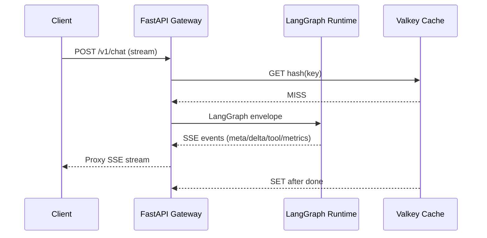
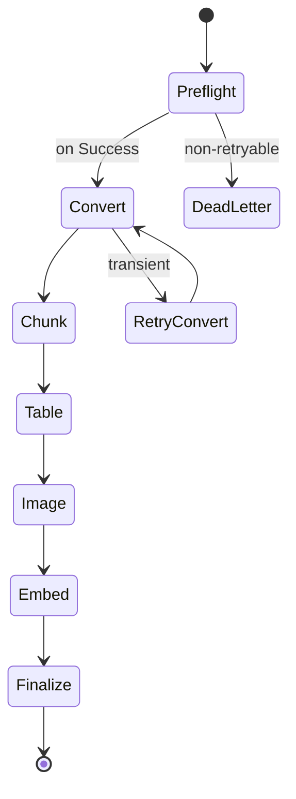

<!-- markdownlint-disable MD013 MD022 MD031 MD032 -->

# API & Event Contracts Deep Dive

## 1. REST Gateway Contracts
### 1.1 Shared HTTP Semantics

| Concern | Contract |
| --- | --- |
| Auth | `Authorization: Bearer <token>` issued by upstream identity provider; gateway resolves `user_id`, `roles`, `scopes`, and country defaults (no org concept). |
| Rate limits | `X-RateLimit-Limit`, `X-RateLimit-Remaining`, `Retry-After` on 429. Permits allocated via centralized limiter described in [system_architecture.md §2.2.10](../overview/system_architecture.md#2210-rate-limiting). |
| Demo mode headers | When `REDUCED_SCOPE_ENABLED=1`, responses include `X-RateLimit-Policy: demo-mode`, `X-Cache-Mode: text-only`, and `Viz-Demo-Mode: text-only` so clients know Valkey/rate limiting are bypassed. SSE streams emit `demo_mode_skipped` events for every suppressed capability. |
| Idempotency | Optional `Idempotency-Key` header (UUID v4, ≤36 chars). Required on `POST /v1/documents/upload` and `POST /v1/export/pdf`, optional elsewhere. |
| Correlation IDs | Gateway injects `Viz-Request-Id` (UUID) + `Traceparent` (W3C). Downstream services must echo them back. |
| Error envelope | All 4xx/5xx return `{"error": {"code": "...", "message": "...", "details": {...}, "request_id": "...", "retry_after_sec": <optional>}}`. Codes map to enums: `VALIDATION_ERROR`, `RATE_LIMITED`, `NOT_FOUND`, `CONFLICT`, `UPSTREAM_TIMEOUT`, `INTERNAL_ERROR`. |
| Pagination | Cursor-based: `?cursor=<opaque>&limit=<int 1-200>`. Response attaches `page_info: {"next_cursor": "...", "remaining_count": <int>}`. |
| Document scope | Conversations reference documents via the `conversation_documents` bridge; APIs that accept `document_id` silently dedupe repeated uploads (same user + hash) and honor base-doc visibility rules. |

### 1.2 POST /v1/documents/upload
Purpose: Register a document, obtain a presigned upload URL, and seed the ingestion workflow.

**Request** (`Content-Type: application/json`):

```json
{
  "document_name": "FY24_Fiscal_Report.pdf",
  "source_type": "pdf",
  "country_code": "LBR",
  "language": "en",
  "tags": ["finance", "pillar:revenues"],
  "content_hash": "79ce...", // optional SHA-256 over normalized bytes
  "file_size_bytes": 7340032,
  "access_scope": "user_private", // enums: user_private (default), user_shared; base requires admin token
  "callback_url": "https://ops.vizonomy.com/hooks/ingestion",
  "metadata": {"department": "MoF", "confidentiality": "internal"}
}
```
Constraints: `source_type ∈ {pdf, docx, html, csv}` (others rejected); `file_size_bytes ≤ 100 MB`; `access_scope='base'` allowed only for admin/service tokens.

**Response (201 new upload / 200 dedup)**:

```json
{
  "document_id": "doc_a12b3",
  "ingestion_id": "ing-5f9c0a",
  "status": "PENDING_UPLOAD", // or "DEDUPED"
  "content_hash": "79ce...",
  "access_scope": "user_private",
  "deduped_from": null,
  "upload": {
    "url": "https://s3.amazonaws.com/raw-docs/...",
    "fields": {
      "key": "raw/ing-5f9c0a/source.pdf",
      "Content-Type": "application/pdf",
      "x-amz-meta-content-hash": "79ce..."
    },
    "expires_in_sec": 900
  },
  "request_id": "..."
}
```
When the payload matches an existing `(owner_user_id, content_hash)` document, the API returns `200 OK` with `status="DEDUPED"`, `ingestion_id=null`, `upload=null`, and `deduped_from` pointing to the prior document.

**Semantics**:

- Upload completion (HTTP 204 from S3) emits the S3 event described in §2.1.
- If the caller supplies `content_hash`, the gateway performs a preflight lookup; duplicates short-circuit to `DEDUPED` without issuing presigned URLs.
- When `content_hash` is omitted, the preprocessing Lambda computes it post-upload and still dedupes before chunking.
- Base documents (`access_scope='base'`) bypass dedup-with-user logic and require admin/service credentials; they inherit sharing rules from `country_code`.
- Duplicate `Idempotency-Key` returns the original payload with `status` reflecting latest pipeline stage.
- Validation failures return `400 + VALIDATION_ERROR` with field-level issues.

> **Reduced Scope (Epic 3.5):** `POST /v1/documents/upload` runs synchronously in text-only mode. Only `content_type="text/markdown"` + `chunk_type="text"` payloads are accepted. When callers submit image/table chunks the API returns `202 Accepted` with `{ "status": "feature_disabled" }`, a `Retry-After: 86400` header, and records the skipped capability inside `document.metadata_.reduced_scope.skipped`. Successful uploads immediately mark the document `active`, create a single text chunk, and return `status="COMPLETED"` plus `ingestion_id` referencing the auto-completed job.

### 1.3 POST /v1/chat
Primary conversational endpoint anchored to LangGraph threads.

**Request** (`Content-Type: application/json`):
```json
{
  "thread_id": "thr_92aa2",
  "session_id": "sess_a1",
  "message": {
    "type": "user",
    "content": "Compare Liberia vs Ghana revenue growth in 2023",
    "attachments": [
      {"type": "document_reference", "document_id": "doc_base_LBR_macro", "scope": "base", "visibility": "visible"},
      {"type": "document_reference", "document_id": "doc_user_42_budget", "scope": "user", "visibility": "hidden"}
    ]
  },
  "hints": {"route": "analyst"},
  "prompt_overrides": {"temperature": 0.2},
  "response_mode": "stream", // or "blocking"
  "constraints": {
    "max_tool_calls": 4,
    "country_code": "LBR",
    "auto_attach_base_docs": true
  }
}
```

Missing `thread_id` triggers server-side creation (`thr_<uuid>`). `session_id` groups multiple chat completions for analytics but is optional.

`message.attachments[]` entries referencing `type="document_reference"` drive the `conversation_documents` bridge:
- `document_id` must already exist (base pool or prior upload).
- `scope` is echoed back in transcripts so clients know whether the doc is base (`base`) or user-provided (`user`).
- `visibility` overrides default retrieval behavior (`visible`, `hidden`, `read_only`). Hidden attachments remain in the bridge for auditing but Retrieval honors the override.
- Setting `constraints.auto_attach_base_docs=true` attaches the default per-country base set before LangGraph executes; explicit attachments win on conflicts.

**Streaming response (SSE)**:
Events are sent with `Content-Type: text/event-stream`, `Cache-Control: no-store`. Event types:

| Event | Payload |
| --- | --- |
| `meta` | `{ "thread_id": "thr_...", "route": "analyst", "request_id": "..." }` |
| `delta` | `{ "content": "partial text", "citations": ["cit_123"] }` |
| `tool_call` | `{ "tool_name": "PolarsSQLTool", "call_id": "call_1", "arguments": {"sql": "SELECT ..."} }` |
| `tool_result` | Mirror of `tool_call` with `status`, `output`, `latency_ms`. |
| `interrupt` | `{ "type": "clarification", "prompt": "Need GDP base year" }` |
| `metrics` | `{ "tokens_prompt": 1234, "tokens_completion": 245, "retrieval": {"hybrid_k": 10}, "document_scope": {"base": ["doc_base_LBR_macro"], "user": ["doc_user_42_budget"]} }` |
| `demo_mode_skipped` | `{ "capability": "vision", "reason": "reduced_scope", "metadata": {"allowed_chunk_types": ["text"]} }` emitted once per suppressed capability. |
| `done` | `{ "status": "COMPLETED", "answer": "...", "citations": [{"doc_id": "doc_a12b3", "chunk_id": "ch_9"}], "cache_hit": false }` |
| `task_error` | `{ "code": "INTERNAL_ERROR", "message": "boom", "retryable": false }` |

**Gateway implementation notes**:

- `POST /v1/chat` is now served directly from FastAPI via `services/agent-api/src/agent_api/http/app.py` and `services/agent-api/src/agent_api/http/routes/chat.py`. Requests inherit a `Viz-Request-Id` whether or not the caller supplies one, and the ID is echoed on every response (streaming + blocking).
- Streaming responses set `Content-Type: text/event-stream`, `Cache-Control: no-cache, no-store`, `Connection: keep-alive`, and `X-Accel-Buffering: no` so nginx/ALB do not buffer the feed. The gateway injects comment-based keep-alives (`: keep-alive`) at ≤10s intervals via `SSEEmitter`.
- Blocking responses share the same request schema but add `Cache-Control: no-store` to guarantee intermediaries do not cache transcripts.
- The gateway emits an initial `meta` frame (thread/session/request identifiers) before LangGraph fires node-level telemetry frames, and emits `task_error` when uncaught exceptions propagate. Clients should treat `task_error` as terminal and rely on the accompanying HTTP 5xx to trigger retries.

Blocking mode returns the final `done` payload plus `messages` array in a single JSON response. When reduced scope is active, the initial `meta` event (and blocking response envelope) also embed `"reduced_scope": {"text_only_chunks": true, "allowed_chunk_types": ["text"]}` so clients can surface demo-mode banners.

**Errors**: Chat-specific codes include `THREAD_NOT_FOUND`, `INTERRUPT_REQUIRED`, `TOOL_FAILURE`, `CONTEXT_EXPIRED`.



### 1.4 GET /v1/conversations/{id}
Retrieves normalized conversation transcript, optionally expanded with citations.

**Query params**: `cursor`, `limit`, `include_citations` (default `false`), `before`/`after` ISO timestamps for slicing.

**Response 200**:
```json
{
  "conversation_id": "thr_92aa2",
  "attached_documents": [
    {"document_id": "doc_base_LBR_macro", "scope": "base", "visibility": "visible"},
    {"document_id": "doc_user_42_budget", "scope": "user", "visibility": "hidden"}
  ],
  "messages": [
    {
      "message_id": "msg_1",
      "type": "user",
      "content": "...",
      "created_at": "2024-03-02T12:04:05Z"
    },
    {
      "message_id": "msg_2",
      "type": "assistant",
      "content": "...",
      "citations": ["cit_123"],
      "tool_calls": ["call_1"],
      "interrupt": null
    }
  ],
  "page_info": {"next_cursor": "abc", "remaining_count": 42}
}
```
404 returned when the conversation id is unknown to the requesting user (or when the user lacks access to the attached documents).

### 1.5 POST /v1/export/pdf
Triggers the PDF export job described in [system_architecture.md §2.1](../overview/system_architecture.md#21-document-ingestion-pipeline).

**Request**:
```json
{
  "thread_id": "thr_92aa2",
  "answer_id": "ans_8",
  "document_ids": ["doc_a12b3"],
  "format": "pillar_summary",
  "delivery": {"type": "callback", "url": "https://.../exports", "auth_token": "..."}
}
```

**Response 202**:
```json
{
  "job_id": "export_7c1",
  "status": "QUEUED",
  "status_url": "/v1/export/pdf/export_7c1",
  "request_id": "..."
}
```
Gateway enqueues an SQS message (`export_submission` schema outlined in §2.3) consumed by the PDF worker. Duplicate `Idempotency-Key` returns the existing `job_id`.

If `document_ids` is omitted, the exporter pulls the effective attachment set from `conversation_documents` (respecting `visibility_override` and auto-attached base docs). Providing `document_ids` narrower than the conversation scope leaves attachments untouched but constrains export rendering.

### 1.6 GET /v1/pillars/{country_code}
Returns latest precomputed pillar answers for the requested country.

**Query params**: `version` (default latest), `pillars` (comma-separated subset), `format` (`summary` or `full`).

**Response 200**:
```json
{
  "country_code": "LBR",
  "version": 12,
  "generated_at": "2024-02-28T00:00:00Z",
  "pillars": [
    {
      "pillar": "revenues",
      "score": 0.78,
      "summary": "...",
      "sources": [{"doc_id": "doc_a12b3", "chunk_id": "ch_9"}]
    }
  ]
}
```
Conditional caching allowed for 5 minutes via `ETag` / `If-None-Match`.

> **Reduced Scope:** Pillar calls now return JSON payloads only; PDF/export workflows are paused until Valkey/worker features return. Only sources backed by `chunk_type="text"` are emitted, so image/table citations are silently skipped with `reduced_scope` metadata communicating the limitation.

### 1.7 POST /v1/conversations/{id}/attachments
Creates or reactivates a `conversation_documents` bridge row.

**Request**:
```json
{
  "document_id": "45e3...",
  "visibility": "visible", // optional override
  "role": "primary",
  "auto_attach_base_docs": true
}
```

**Response** `201/202`:
```json
{
  "conversation_id": "thr_92aa2",
  "document_id": "45e3...",
  "status": "ATTACHED",
  "attachment": {
    "document_id": "45e3...",
    "attach_source": "user_request",
    "role": "primary",
    "visibility": "visible"
  },
  "auto_attached": ["doc_base_LBR_macro"],
  "request_id": "..."
}
```

- If `auto_attach_base_docs=true`, the API also attaches active base documents for the conversation’s country and lists them under `auto_attached`.
- Image/table documents are short-circuited with `202 Accepted`, `{ "status": "FEATURE_DISABLED" }`, and `Retry-After: 86400`. The skip is recorded in `document.metadata_.reduced_scope.skipped` for auditing.
- Base-scope documents cannot be detached; clients should mark them `visibility=hidden` instead until the full workflow returns.

### 1.8 GET /v1/conversations/{id}/attachments
Lists the effective attachment set with the same `AttachmentRecord` schema used in the mutation response. Hidden/read-only entries remain in the payload so clients can expose audit controls, but retrieval still honors the stored visibility.

### 1.9 GET /v1/conversations/{id}/pillars
Returns the same JSON structure as `GET /v1/pillars/{country_code}` scoped to the conversation’s active attachments. Only answers referencing the attached document set are returned; when no attachments exist, the API responds with an empty `pillars` array and still echoes the `conversation_id` + reduced-scope metadata so Task 03 can render deterministic screens.

## 2. Ingestion Workflow Event Contracts
### 2.1 S3 Trigger Event
Uploading to `raw-documents` bucket emits the canonical S3 notification routed through EventBridge. Payload excerpt:
```json
{
  "version": "0",
  "id": "c3d60b18",
  "detail-type": "Object Created",
  "source": "aws.s3",
  "account": "123456789",
  "time": "2024-03-04T12:00:00Z",
  "region": "us-east-1",
  "detail": {
    "bucket": {"name": "vizonomy-raw-documents"},
    "object": {
      "key": "raw/ing-5f9c0a/source.pdf",
      "size": 7340032,
      "etag": "...",
      "sequencer": "0065E5..."
    }
  }
}
```
EventBridge rule filters on prefix `raw/` and suffix `.pdf|.docx|.html|.csv`. The rule targets the Step Functions state machine `DocumentIngestionStateMachine` with a transformed input described below.

### 2.2 Step Functions State Envelope
Each execution input envelops all metadata required for deterministic retries:
```json
{
  "ingestion_id": "ing-5f9c0a",
  "document_id": "doc_a12b3",
  "access_scope": "user_private",
  "s3_key": "raw/ing-5f9c0a/source.pdf",
  "country_code": "LBR",
  "language": "en",
  "content_hash": "79ce...",
  "status": "RECEIVED",
  "trace_id": "trace-...",
  "retries": {"preflight": 0, "convert": 0, "chunk": 0},
  "timestamps": {"uploaded_at": "..."},
  "callback_url": "https://.../hooks/ingestion"
}
```
Each task state appends to `audit_log[]` entries shaped as `{"state": "Preflight", "started_at": "...", "ended_at": "...", "status": "SUCCEEDED", "retries": 1}`.

State transitions:
1. **Preflight Validation** → 2. **Document Conversion** → 3. **Semantic Chunking** → 4. **Table Normalization** → 5. **Image Captioning** → 6. **Embedding & Indexing** → 7. **Finalize** (writes status, emits EventBridge `ingestion.completed`). Failures route to `DeadLetter` state and emit `ingestion.failed`.



### 2.3 Lambda Contracts

| State | Lambda | Input Focus | Output / Side Effects | Retry / Idempotency |
| --- | --- | --- | --- | --- |
| Preflight Validation | `preflight-validator` | S3 key, checksum, declared metadata | Emits/updates `documents` row (status `VALIDATING`), writes artifact placeholder records, returns `converted_key` prefix | Retries `max_attempts=2` on `VALIDATION_TRANSIENT`. Duplicate events short-circuit using `(document_id, content_hash)` plus `ingestion_id` idempotency keys. |
| Document Conversion | `marker-converter` | Preflight output, pointer to raw object | Uploads `converted/ing-.../document.mmd` + `structured.json`, returns block inventory: `{ "pages": [...], "tables": [...], "figures": [...] }` | Idempotent via deterministic output paths; retries `max_attempts=3` with exponential backoff. |
| Semantic Chunking | `chunk-builder` | Block inventory, country metadata | Generates chunk JSON lines (`chunks/ing-.../*.jsonl`), returns chunk ids + token counts | Idempotent: chunk hash includes doc_id + block offsets; reruns perform compare-and-swap. |
| Table Normalization | `table-normalizer` | Table blocks | Writes normalized table JSON to `tables/{doc}/{block}.json`, returns schema summaries for indexing | Retries unlimited on throttling, DLQ after 5 minutes cumulative. |
| Image Captioning | `figure-captioner` | Figure crops | Calls GPT-5-nano for low-detail captions, escalates to GPT-5-mini when `confidence < 0.7`, stores captions in `figures/` prefix | Retries once on LLM timeout. Idempotent because outputs stored by `{doc_id, figure_id}`. |
| Embedding & Indexing | `embedding-writer` | Chunks + schema summaries + captions | Calls Voyage embedding API, batches 256 vectors per transaction, writes to Postgres/pgvector plus Valkey warm cache | Retries with jitter on API 429/5xx. Maintains `vector_jobs` table tracking attempts and final status. |
| Finalize | `ingestion-finalizer` | Aggregated context | Updates `documents` status to `READY`, publishes EventBridge `ingestion.completed` event, optionally POSTs callback URL | Single attempt; failures routed to DLQ for manual replay.

EventBridge emissions:
- `ingestion.progress`: `{ "ingestion_id": "...", "stage": "chunking", "percent_complete": 45 }`
- `ingestion.completed`: `{ "ingestion_id": "...", "document_id": "...", "content_hash": "79ce...", "access_scope": "user_private" }`
- `ingestion.failed`: `{ "ingestion_id": "...", "failed_state": "embedding", "error_code": "VOYAGE_429", "will_retry": true }`

## 3. LangGraph Payload Envelopes
### 3.1 ThreadEnvelope
Canonical object passed between the FastAPI gateway and LangGraph runtime, then persisted per checkpoint.
```json
{
  "thread_id": "thr_92aa2",
  "conversation": {
    "messages": [
      {"id": "msg_12", "type": "user", "content": "...", "created_at": "..."}
    ],
    "country_code": "LBR",
    "document_scope": {
      "base": ["doc_base_LBR_macro"],
      "user": ["doc_user_42_budget"]
    },
    "cache_key": "hash(...)"
  },
  "routing": {
    "requested_route": "analyst",
    "confidence": 0.64,
    "retry_counters": {"retrieval_loops": 0, "repairs": 0}
  },
  "limits": {
    "max_tool_calls": 4,
    "deadline_ms": 60000
  },
  "meta": {
    "request_id": "...",
    "traceparent": "00-...",
    "origin": "go-gateway"
  }
}
```

`document_scope` is synthesized from `conversation_documents`, so every LangGraph run knows exactly which base vs user documents (post `visibility_override`) may be queried or cited.

### 3.2 Node Payload Responsibilities
- **InputNormalizer → Router**: Attaches `normalized_prompt`, `language`, `intent_embeddings`, and `risk_flags` (prompt injection, compliance). Output schema:
  ```json
  {
    "normalized_prompt": "...",
    "language": "en",
    "intent": {"label": "compare", "score": 0.82},
    "guardrails": {"pii_detected": false, "policy_block": false}
  }
  ```
- **Router → Retrieval Orchestrator**: Wraps `route`, `retrieval_plan`, `doc_filters`. Example:
  ```json
  {
    "route": "analyst",
    "retrieval_plan": {
      "query_variants": ["Liberia revenue growth 2023", "Ghana fiscal 2023"],
      "hybrid_k": 10,
      "expansion": "keyword"
    },
    "doc_filters": {
      "country_code": ["LBR", "GHA"],
      "doc_types": ["report"],
      "document_scope": {"base": ["doc_base_LBR_macro"], "user": ["doc_user_42_budget"]}
    }
  }
  ```
- **Retrieval Orchestrator → RAGTool Nodes**: Each parallel retriever receives `{ "query": "...", "mode": "text|table|image|keyword", "limit": <int>, "filters": {...} }` and returns `{ "candidates": [{"doc_id": "...", "chunk_id": "...", "score": 0.71, "snippet": "..."}], "retrieval_metrics": {...} }`.
- **Subgraph Entry Node (per route)**: Consumes `final_context` (reranked list), `tool_budget`, and `verification_requirements`. Example for Numerical route:
  ```json
  {
    "final_context": [
      {"chunk_id": "ch_9", "doc_id": "doc_a12b3", "page": 12, "evidence": "..."}
    ],
    "tool_budget": {"polars_sql_tool": 3},
    "verification": {"require_citations": true, "min_sources": 2}
  }
  ```

### 3.3 Tool Call Envelope
All tool interactions follow:
```json
{
  "call_id": "call_1",
  "thread_id": "thr_92aa2",
  "tool_name": "PolarsSQLTool",
  "input": {
    "sql": "SELECT revenue_growth FROM tbl_4 WHERE country = 'Liberia'",
    "context_tables": ["tbl_4"]
  },
  "state_snapshot": {"route": "numerical", "loop_iteration": 1},
  "timeouts_ms": {"execution": 2000}
}
```
Results:
```json
{
  "call_id": "call_1",
  "status": "SUCCEEDED",
  "output": {"result": [{"revenue_growth": 0.12}]},
  "latency_ms": 540,
  "error": null
}
```
Failures include `error: {"code": "QUERY_VALIDATION_ERROR", "message": "Syntax error in SQL query", "details": {"sql": "..."}}`. These envelopes are logged and attached to the conversation transcript for provenance.

### 3.4 Interrupt & Resume Contract
When LangGraph raises an interrupt, it emits:
```json
{
  "thread_id": "thr_92aa2",
  "interrupt": {
    "type": "clarification",
    "prompt": "Which fiscal year should I prioritize?",
    "required_fields": ["year"],
    "timeout_sec": 900
  },
  "pending_state": {
    "node": "Router",
    "serialized_state": "base64(...)"
  }
}
```
Gateway surfaces this via SSE `interrupt` event. Client responses must POST `/v1/chat` with the same `thread_id`, include `interrupt_token` issued in the event, and optionally `clarification_response`. LangGraph resumes from the serialized node state, guaranteeing idempotent continuation.

**HITL SSE payloads** (Task 12 will stream these verbatim):

```json
{
  "event": "hitl_pause",
  "conversation_id": "conv_123",
  "checkpoint_id": "chk_9f8b",
  "resume_token": "f3d4c8...",
  "reason": "low_confidence",
  "route": "informational",
  "confidence": 0.32,
  "guardrail_codes": [],
  "timestamp": "2025-12-02T17:04:22.123Z"
}
```

On resume, the same schema is reused with `event="hitl_resume"`, `reason="hitl_resume"`, and `resume_token` set to the consumed token so clients can correlate transcripts.

---
These contracts establish the concrete wire formats needed to implement the FastAPI gateway, ingestion workflow, and LangGraph orchestration without ambiguity, while leaving headroom for future routes (gRPC, webhooks) to reuse the same envelope patterns.
