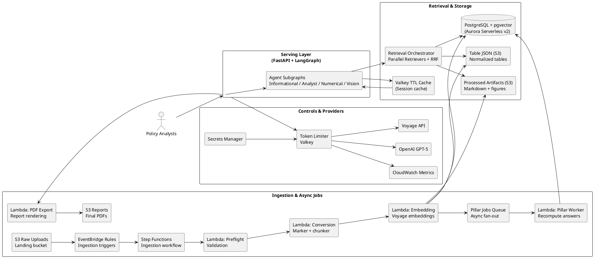
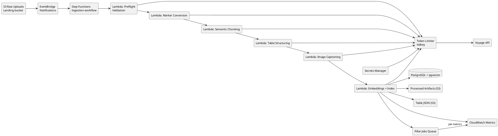
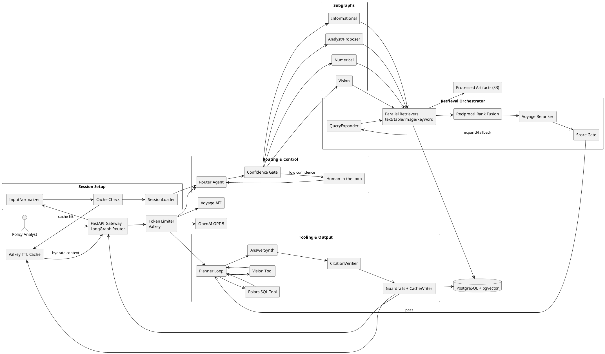
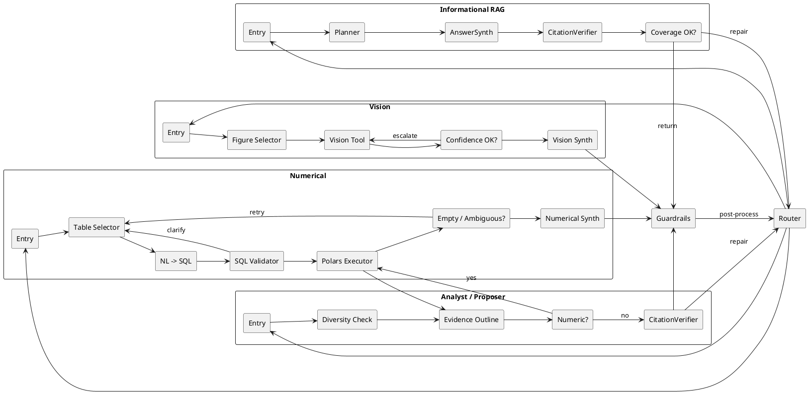
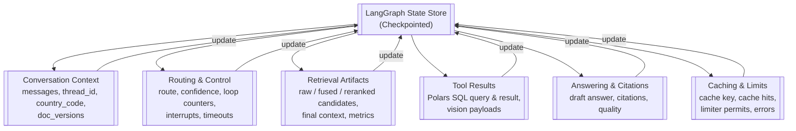
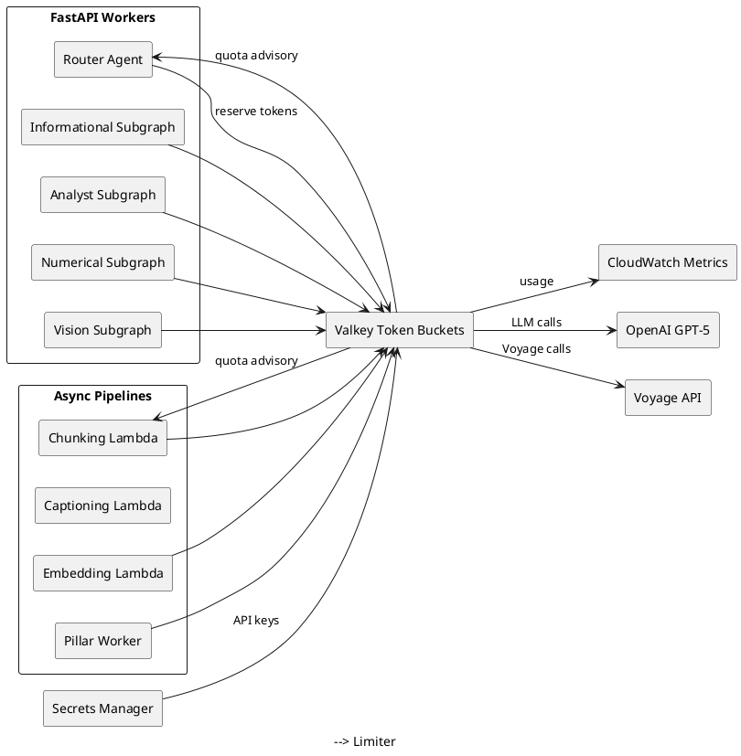
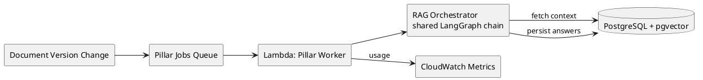
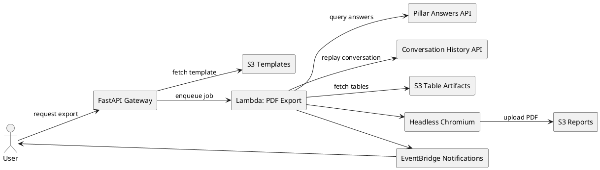
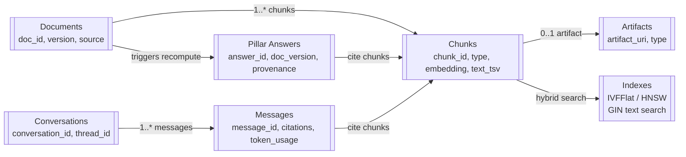

# System Design Document

## 1. System Architecture

### 1.1. Overview

The platform topology below is rendered directly from PlantUML so it stays versioned with
the surrounding text.

### 1.2. Core Components

#### 1.2.1. Compute

EC2 t4g.micro (or Fargate spot) hosts the FastAPI + LangGraph ASGI stack, while Lambda functions handle bursty ingestion and async document processing.

#### 1.2.2. Vector Storage

PostgreSQL with pgvector extension for structured metadata and vector embeddings.

#### 1.2.3. AI Models: Managed Voyage AI Stack

Voyage AI for embeddings (voyage-3.5-lite) and reranking (rerank-2.5-lite), OpenAI for chat (GPT-5-mini) and vision.

**Alternatives Considered**:

1. **OpenAI Embeddings + Voyage Reranker**: Multi-provider complexity (separate APIs, rate limits, billing)  
2. **Self-Hosted Reranker**: High cold-start latency (Lambda) or baseline cost (Fargate), plus operational burden. Higher costs and lower reliability than managed service.

#### 1.2.4. Agent Orchestration

Graph-based agent built with LangGraph, as it provides explicit control over agent execution flow. Enabling deterministic loops, branching, retries, and state management without black-box behavior. Centralizes control and eliminates inter-agent RPC overhead.

> **Detailed Design**: See [Agent Architecture](../agents/architecture.md) and [Implementation Details](../agents/implementation.md).

## 2. Component Design

### 2.1. Document Ingestion Pipeline

Serverless workflow transforms raw PDFs into structured, searchable artifacts.

**Workflow**:

1. **Trigger**: S3 upload triggers EventBridge rule  
2. **Orchestration**: Step Functions coordinates Lambda sequence with retries and error handling  
3. **Processing**:  
   - **Preflight Validation**: Verifies MIME type, extracts metadata, assigns country code, creates database record with version tracking  
   - **Marker PDF Conversion**: Converts PDF to Markdown (display) and hierarchical JSON (processing) preserving block types, coordinates, page numbers  
   - **Semantic Chunking**: Creates ~500-token coherent segments respecting structural boundaries  
   - **Table Transformation**: Generates normalized JSON, natural-language captions, and schema summaries  
   - **Image Captioning**: Extracts figures, generates factual captions with GPT-5-nano  
   - **Embedding & Indexing**: Computes Voyage AI embeddings for all retrievable units, upserts vectors and metadata to PostgreSQL/pgvector

### 2.2. Agent Orchestration and Retrieval

Router Agent classifies intent and coordinates multi-track retrieval and execution.

**Retrieval Workflow**:

1. **Parallel Retrieval**: RAGTool executes four channels simultaneously:  
   - **Text Retriever**: Semantic vector search over text chunks  
   - **Table Retriever**: Semantic search over table captions and schema summaries  
   - **Image Caption Retriever**: Semantic search over image captions  
   - **Keyword Search**: Full-text search (tsquery) over text chunks  
2. **Fusion (RRF)**: Combines results using Reciprocal Rank Fusion  
3. **Reranking**: Voyage AI cross-encoder reranks top candidates for precise context

#### 2.2.1. Agentic Subgraphs

Router directs queries to specialized subgraphs:

**Informational RAG**: Provides sourced answers with strict citations. CitationVerifier validates coverage; failed validation triggers targeted retrieval repair (bounded retries).

**Analyst/Proposer**: Synthesizes information across documents for grounded recommendations. Ensures source diversity. Delegates numeric calculations to Numerical subgraph and reintegrates results with citations.

**Numerical**: Performs all quantitative analysis using a unified Polars SQL tool.

- **PolarsSQLTool**: Translates natural language to a safe Polars SQL query, executed in a sandboxed environment. It handles both complex table queries (e.g., aggregations, joins) and simple arithmetic. This approach is 100% safe from code injection and exposes the exact formula used for transparency and logging.

**Vision**: Retrieves and analyzes figures using GPT-5 models. Prefers low-detail captioning, escalates to higher detail when confidence drops below threshold. Outputs visual summaries with figure/page citations.

#### 2.2.2. Tool Ecosystem

- **RAGTool**: Retrieval Orchestrator subgraph (Parallel Retrievers + Fusion/RRF + Reranker)  
- **PolarsSQLTool**: A unified tool for all numerical and table-based queries. It executes Polars SQL, handling everything from simple math (`SELECT 1+1`) to complex data analysis. It is sandboxed, safe from code injection, and provides transparent, loggable formulas for all calculations.
- **VisionTool**: Retrieves and analyzes images with confidence-based detail escalation
- **Voyage Reranker**: Applies top_k and truncation per model limits

#### 2.2.3. Graph State Model

**State Categories**:

- **Conversation/context**: messages, conversation/thread IDs, country_code, doc_version_ids  
- **Routing/control**: route, confidence, loop counters, interrupts, timeouts  
- **Retrieval artifacts**: raw/fused/reranked candidates, final_context, retrieval_metrics  
- **Tool results**: sql_query/result, vision inputs/results
- **Answering/citations**: draft_answer, citations (doc_id, chunk_id, page, evidence_text, score), final answer, quality  
- **Caching/limits**: cache_key, cache_hits, rate_limiter_permits, errors

#### 2.2.4. Node Responsibilities

**Flow**: InputNormalizer → SessionLoader → Router → Retrieval Orchestrator → Subgraphs → Guardrails

**Retrieval Orchestrator**: QueryExpander → ParallelRetrievers (text, table, image, keyword) → Fusion (RRF) → Reranker (Voyage)

**Subgraphs**: Informational RAG, Analyst/Proposer, Numerical, Vision

**Cross-cutting**: CacheReturn, Guardrails, ErrorHandler/Retry, RateLimiter

#### 2.2.5. Control Flow

- **Entry/Exit**: START → InputNormalizer; cache hit → CacheReturn → END  
- **Routing**: SessionLoader → Router; low confidence triggers human-in-the-loop interrupt  
- **Retrieval**: Score thresholds trigger expansion, keyword fallback, or filter relaxation; bounded loops  
- **Tools**: Enforces single tool call per loop iteration  
- **Verification**: Failed citations trigger targeted retrieval repair with retry limits; graceful degradation on exhaustion  
- **Timeouts**: Node timeouts route to ErrorHandler; global deadline preempts loops

#### 2.2.6. Concurrency

- **Parallelism**: Fan-out ParallelRetrievers, fan-in at Fusion; dynamic fan-out via Send.
- **Async Execution**: CPU-bound, blocking operations (e.g., PDF parsing, Polars queries) **must** be offloaded from the main event loop to a thread pool (e.g., using `asyncio.to_thread` or Polars' native `collect_async()`) to prevent freezing the application.
- **Semantics**: Per thread_id sequential; per-tool concurrency ceilings.
- **Rate Limiting**: Gates LLM-bound nodes (Router, QueryExpander, AnswerSynthesizer, VisionTool).

#### 2.2.7. Persistence

- **Checkpointing**: Persists state at node boundaries; thread_id anchors sessions  
- **Storage**: final_context, reranked_candidates, tool traces for deterministic replay and caching

#### 2.2.8. Human-in-the-Loop

- **Interrupts**: Nodes raise interrupts for clarification/disambiguation  
- **Resume**: Continues from same node with injected input; nodes should be idempotent

#### 2.2.9. Error Handling

- **Guardrails**: Content/PII policy enforcement; prompt-injection defenses  
- **Errors**: Transient vs permanent classification with exponential backoff  
- **Fallbacks**: Safe responses on persistent errors (apology + next steps + partial provenance)

#### 2.2.10. Rate Limiting

- **Integration**: LLM nodes acquire permits with lane priorities (interactive > batch)  
- **Features**: Token-aware estimation, backoff windows, linked to platform-wide system

### 2.3. Centralized Resource Management

Shared limiter SDK provides unified, token-aware rate limiting for all LLM calls across platform.

**Architecture**: Token bucket algorithm in Valkey (Lua) for atomic operations

**Token-Aware**: Tiktoken pre-flight estimation with safety margin

**Priority Lanes**: Weighted token requests with reserved capacity for high-priority traffic

**Smart Scheduling**: Parses OpenAI rate limit headers for precise backoff windows. Lambda exits for Step Functions/SQS retry; EC2 awaits permits

**Security**: API keys in AWS Secrets Manager

### 2.4. Asynchronous Jobs

#### 2.4.1. Pillar Answer Engine

Pre-computes answers to policy questions.

**Process**: Uses identical RAG chain as interactive queries for consistency

**Triggers**: SQS jobs on document version changes or API calls

**Storage**: Idempotent answers in Pillar Answers table with full provenance and citations

#### 2.4.2. PDF Export Service

Decoupled service for PDF report generation.

**Process**: Lambda fetches Jinja template from S3, queries data sources, renders HTML, generates PDF with Headless Chromium

**Output**: Reports stored in dedicated S3 bucket; completion events via EventBridge/SNS

## 3. Data Design

### 3.1. Database Schema

> **Deep Dive**: See [Schema & Persistence](../data/schema_and_persistence.md) for full table definitions and lifecycle rules.

**Tables**:

- **Documents**: Document metadata (title, source_uri, country_code, version)  
- **Chunks**: Core retrieval table with searchable units (text, table, image) including embeddings (pgvector), text_tsv, type, doc_id, page_num, bbox, artifact_uri, schema_summary  
- **Artifacts**: External content references (table_json, figure_image) in S3  
- **Pillar Answers**: Pre-computed answers with versioning and provenance  
- **Conversations & Messages**: Complete interaction history with token usage, citations, tool calls

### 3.2. Indexing Strategy

**Vector Indexes**: ivfflat or hnsw on chunks.embedding for ANN search

- **Operator classes**: vector_cosine_ops (normalized), vector_ip_ops (inner product), vector_l2_ops (L2 distance)  
- **ivfflat**: lists based on data size (rows/1000 up to ~1M rows; sqrt(rows) beyond), tune probes for recall/latency balance, enable iterative_scan for filtered queries  
- **hnsw**: Tune ef_search for recall/latency; consider m/ef_construction at build time, partial indexes for frequent filters

**Full-Text Index**: GIN index on chunks.text_tsv for keyword search

**B-Tree Indexes**: Foreign keys and common filters (country_code, doc_id, version, type)

**Hybrid Pattern**: Early metadata filters, vector + tsquery retrieval, RRF fusion, Voyage reranking

### 3.3. Artifact Storage

**Tables**: Normalized JSON at s3://.../tables/{doc}/{block}.json

**Figures**: Raw images (figure_image) with associated figure_caption (text), both linked in Chunks table

### 3.4. Citations

**Citation Record**: doc_id, chunk_id, page_num, offsets/bbox, evidence_text, score

**Rules**: One citation per atomic claim/sentence; numeric derivations cite raw source rows

**Persistence**: Citations attached to answers/messages for analytics/audits

## 4. Interface Design

### 4.1. API Design

> **Deep Dive**: See [API Contracts](../interfaces/api_contracts.md) for detailed endpoint specifications and event payloads.

FastAPI Gateway provides RESTful interface:

- **POST /v1/documents/upload**: Initiates document ingestion pipeline  
- **POST /v1/chat**: Primary conversational endpoint with session management  
  - Accepts thread_id for checkpointed sessions and human-in-the-loop resume  
  - Surfaces interrupt payloads; resume with same thread_id  
  - Optional streaming for intermediate updates  
- **GET /v1/conversations/{id}**: Retrieves conversation history  
- **POST /v1/export/pdf**: Triggers PDF export job  
- **GET /v1/pillars/{country_code}**: Retrieves pre-computed Pillar Answers

### 4.2. Configuration

**Models**:

- Chat: OpenAI GPT-5-mini  
- Embeddings: Voyage AI voyage-3.5-lite  
- Reranking: Voyage AI rerank-2.5-lite  
- Vision Captioning: OpenAI GPT-5-nano (detail=low)  
- Vision Analysis: OpenAI GPT-5-mini

**Retrieval**:

- hybrid_k: 10 (final results)  
- RRF k: ~60 (tunable)  
- Candidates before rerank: 50-200 (token-budget dependent)  
- pgvector tuning: ivfflat lists/probes, hnsw ef_search, iterative_scan modes

**Reranking**: top_k default (e.g., 32); truncation=true; respect model limits

**Loops/Thresholds**:

- max_retrieval_loops: 2; max_repairs: 1  
- min_fused_score/min_rerank_score: empirically tuned

**Chunking**: ~500 tokens per chunk, ~50 tokens overlap

**Cache TTL**: 48-72 hours for Valkey TTL cache

**Human-in-the-Loop**: Checkpointer required for interrupts; stable thread_id across resumptions (Not necessary in the first stage)

### 4.3. Cache Key Generation

Deterministic hash function incorporating all response variables:

hash(
  country_code,
  normalized_prompt,
  sorted_document_version_ids,
  agent_route,
  tool_parameters (jq_hash, calc_inputs),
  retrieval_parameters (k, thresholds)
)

**Operations**: Cache check after InputNormalizer; write-through after finalization
